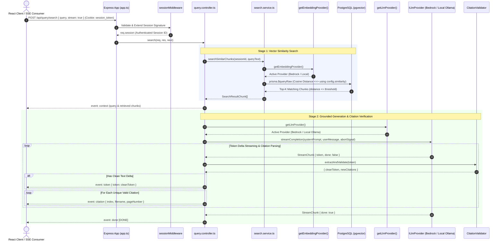

# Query Engine Architecture Specification (Tasks 301 & 302)

This document details the unified architecture, provider abstraction models, database similarity search, prompt assembly, citation verification engine, SSE streaming contract, and test verification suite for the Query Engine in `apps/api`.

---

## 1. Unified System Architecture & Flow

The Query Engine handles search questions submitted via `POST /api/query/search`. It executes a 2-stage Retrieval-Augmented Generation (RAG) pipeline:
1. **Vector Similarity Retrieval**: Embeds the question, executes cosine distance matching against PostgreSQL (`pgvector`) restricted strictly to the user's authenticated session ID, and filters results by distance threshold.
2. **Grounded Answer Generation & Citation Validation**: Assembles a numbered context prompt, streams text deltas from the configured LLM provider over Server-Sent Events (SSE), parses inline `[n]` bracket citations, validates them against retrieved context bounds, and streams metadata frames back to the client.



---

## 2. Decoupled Provider Architectures

Both embedding generation and LLM text completion use swappable provider abstractions driven by central application config (`config/index.ts`).

### Embedding Provider Abstraction (`IEmbeddingProvider`)
Location: [embedding.service.ts](file:///Users/parth/RAG/Document%20Intelligence%20Platform/apps/api/src/services/embedding.service.ts)

- **`BedrockEmbeddingProvider`**: Uses AWS Bedrock Runtime SDK calling `amazon.titan-embed-text-v2:0` with exponential backoff. Authenticates via **IRSA** (IAM Roles for Service Accounts) in EKS.
- **`LocalEmbeddingProvider`**: Uses `@xenova/transformers` (`Xenova/e5-large-v2`) with `"query: "` prefix formatting, matching the Python worker's `"passage: "` chunk indexing.
- **Factory**: `getEmbeddingProvider()` checks `config.embeddings.provider` (`bedrock` | `local`), throwing `UnsupportedEmbeddingProviderError` on invalid values.

### LLM Provider Abstraction (`ILlmProvider`)
Location: [llm.service.ts](file:///Users/parth/RAG/Document%20Intelligence%20Platform/apps/api/src/services/llm.service.ts)

- **`BedrockLlmProvider`**: Uses AWS SDK v3 `InvokeModelWithResponseStreamCommand` (`anthropic.claude-3-haiku-20240307-v1:0`) via IRSA. Retries transient `ThrottlingException` / `ServiceUnavailableException` up to 3 times with exponential backoff.
- **`LocalLlmProvider`**: Connects to Ollama Docker (`http://localhost:11434/v1/chat/completions`) using standard HTTP streaming. Includes an offline stub fallback so tests pass cleanly without Docker.
- **Factory**: `getLlmProvider()` checks `config.llm.provider` (`bedrock` | `local`), throwing `UnsupportedLlmProviderError` on invalid values.

---

## 3. Vector Similarity Search & Tenancy Isolation

Location: [search.service.ts](file:///Users/parth/RAG/Document%20Intelligence%20Platform/apps/api/src/services/search.service.ts)

Query retrieval uses PostgreSQL `pgvector` cosine distance (`<=>`) executed via Prisma `$queryRaw` parameterized tagged template literals:

```sql
SELECT 
  c.id,
  c.document_id,
  c.content,
  c.page_number,
  (c.embedding <=> ${vectorStr}::vector) AS distance,
  d.filename
FROM document_chunks c
JOIN documents d ON c.document_id = d.id
WHERE c.session_id = ${sessionId}::uuid
  AND (c.embedding <=> ${vectorStr}::vector) <= ${config.similarity.distanceThreshold}
ORDER BY (c.embedding <=> ${vectorStr}::vector) ASC
LIMIT ${config.similarity.topK};
```

### Security & Performance
- **Strict Session Tenancy**: `WHERE c.session_id = ${sessionId}::uuid` guarantees total cross-session data isolation.
- **Dynamic Limits**: Distance threshold (`config.similarity.distanceThreshold`, default `0.5`) and match count (`config.similarity.topK`, default `5`) are dynamically configurable via environment variables.
- **HNSW Indexing**: Uses the PostgreSQL HNSW index (`document_chunks_embedding_hnsw_idx` with `vector_cosine_ops`) for fast vector retrieval.

---

## 4. Grounding Prompt Assembly

Location: [llm.service.ts](file:///Users/parth/RAG/Document%20Intelligence%20Platform/apps/api/src/services/llm.service.ts)

The `buildPrompt(query, chunks)` function constructs:
- **System Prompt**: Enforces reference-only grounded answering. Directs the model to cite every claim using sequential bracket index numbers (e.g. `[1]`, `[2]`), and to state `"I could not find relevant information in the provided documents."` if context is insufficient.
- **User Message**: Formats each retrieved chunk sequentially with bracket labels, filenames, and page numbers:
  ```text
  Context Documents:

  [1] Document: report.pdf (Page 3)
  ---
  <chunk content>

  [2] Document: design.pdf (Page 7)
  ---
  <chunk content>

  Question: <user question>
  ```

---

## 5. Citation Parsing & Hallucination Validation Engine

Location: [llm.service.ts](file:///Users/parth/RAG/Document%20Intelligence%20Platform/apps/api/src/services/llm.service.ts)

The `CitationValidator` utility processes incoming text tokens:
1. **Regex Scanning**: Matches `/\[(\d+)\]/g` in text deltas.
2. **Bounds Validation**: Checks if cited index `n` satisfies `1 <= n <= num_chunks`.
3. **Hallucination Stripping**: Citation indices outside the valid range (e.g. `[99]`, `[0]`) are stripped from `cleanToken` before sending to the client, and logged as warnings.
4. **Deduplication**: Maintains a set of emitted indices to ensure each valid source index triggers an `event: citation` metadata frame exactly once per stream.

---

## 6. SSE Frame Contract & Stream Lifecycle

When `POST /api/query/search` is invoked with `Accept: text/event-stream` or `{ stream: true }`:

| Event | Data Payload | Trigger Condition |
|---|---|---|
| `context` | `{ query: string, results: SearchResultChunk[] }` | Emitted immediately after vector similarity search completes. |
| `token` | `{ token: string }` | Emitted for each LLM text delta (after invalid citation stripping). |
| `citation` | `{ index: number, filename: string, pageNumber: number \| null }` | Emitted when a new valid `[n]` citation is parsed. |
| `error` | `{ message: string, errorCode: string }` | Emitted if an unrecoverable LLM streaming error occurs. |
| `done` | `[DONE]` | Emitted when the answer stream finishes. |

### Early Disconnect Protection
The controller instantiates a Node.js `AbortController` linked to Express `req.on('close')`. If the client closes the HTTP connection mid-stream, `abortController.abort()` cancels the active Bedrock or Ollama network request immediately.

---

## 7. Automated Test Suite Verification

Location: [query.test.ts](file:///Users/parth/RAG/Document%20Intelligence%20Platform/apps/api/src/tests/query.test.ts)

All 53 unit and integration tests across 5 test suites pass cleanly:
1. **Embedding Factory**: Resolves `LocalEmbeddingProvider` and `BedrockEmbeddingProvider`; validates vector dimension length (1024).
2. **LLM Factory**: Resolves `LocalLlmProvider` and `BedrockLlmProvider`; throws `UnsupportedLlmProviderError` on invalid names.
3. **Request Body Contract**: Accepts `{ query: "..." }` in JSON body; rejects empty queries with `400 Bad Request`.
4. **Session Security**: Rejects tampered session tokens with `401 Unauthorized`.
5. **Session Tenancy Isolation**: Verifies Session A queries return chunks strictly belonging to Session A documents, excluding Session B documents.
6. **Distance Thresholding**: Excludes vector results exceeding distance threshold.
7. **Prompt Assembly**: Verifies chunk bracket indexing `[1]`, `[2]`, context formatting, and system grounding rules.
8. **Citation Validation**: Verifies metadata extraction, multiple citations per token, hallucination stripping (`[99]`, `[0]`), deduplication, and valid text passthrough.
9. **SSE Integration**: Verifies full streaming cycle emitting `context`, `token`, `citation`, and `done` event frames.
