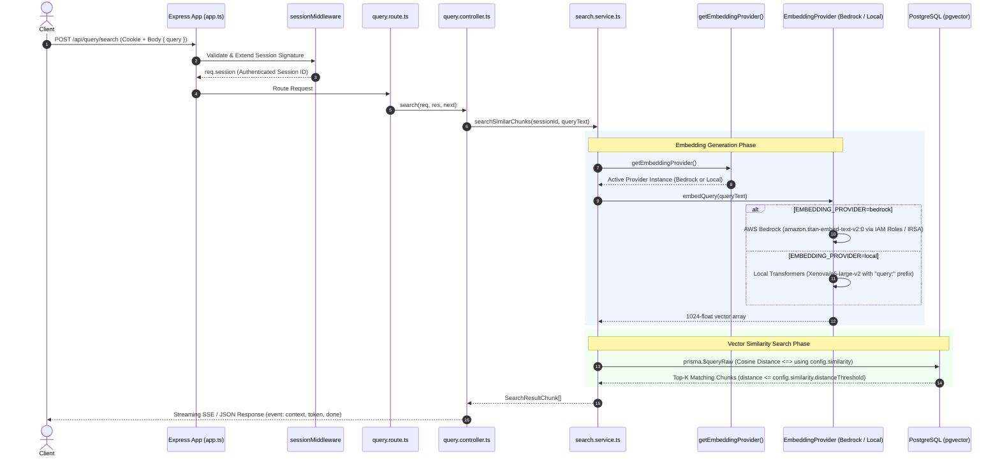

# Task 301: API Similarity Search & Tenancy Enforcement Architecture Spec

This document details the software architecture, dynamic embedding provider factory, database similarity search query design, tenancy isolation security controls, streaming contract, and verification records implemented in Task 301.

---

## 1. Architectural Overview & Sequence Diagram

The similarity search pipeline receives a search question in the JSON request body of a `POST /api/query/search` request (`{ "query": "..." }`) from an authenticated user session, resolves the active embedding provider based on environment settings (`EMBEDDING_PROVIDER`), embeds the question into a 1024-dimension float vector, and executes a parameterized pgvector similarity query using Prisma's `$queryRaw` tagged template literal configured with dynamic similarity threshold limits (`config.similarity`).



---

## 2. Decoupled Embedding Provider Factory & Configuration

To achieve complete execution parity between production cloud environments (AWS Bedrock) and offline local development environments without hardcoding vendor dependencies into query handlers:

* **Single `EMBEDDING_MODEL` Design**: Uses a single unified `EMBEDDING_MODEL` variable (`amazon.titan-embed-text-v2:0` for Bedrock or `Xenova/e5-large-v2` for Local), selected via `EMBEDDING_PROVIDER` (`bedrock` vs `local`).
* **AWS IAM Role (IRSA) Authentication**: Running inside Amazon EKS clusters, Bedrock access authenticates via IAM Roles for Service Accounts (IRSA). No static AWS access keys are passed to `BedrockRuntimeClient`.
* **Local Development (`@xenova/transformers`)**: Configured as a `devDependency` in `package.json`. Employs feature extraction with `"query: <text>"` prefix formatting matching the Python worker's `"passage: <text>"` chunk index formatting. Supports a deterministic vector generator fallback for CommonJS test environments.
* **Dynamic Similarity Configuration (`config.similarity`)**: Search limits are configured dynamically via central application config:
  * `config.similarity.topK`: Derived from `TOP_K` environment variable (default: `5`).
  * `config.similarity.distanceThreshold`: Derived from `SIMILARITY_DISTANCE_THRESHOLD` environment variable (default: `0.5`).
* **Domain-Specific Error Handling**: System failures throw structured `AppError` subclasses:
  * `ValidationError` (`invalid_query` - 400): Missing or empty query in request body.
  * `UnsupportedEmbeddingProviderError` (`unsupported_embedding_provider` - 400): Unrecognized embedding provider.
  * `InternalServerError` (`internal_server_error` / `embedding_provider_error` - 500): Unexpected service failures.

---

## 3. Vector Similarity Query & Strict Tenancy Isolation

Query retrieval in `SearchService.searchSimilarChunks(sessionId, queryText)` uses PostgreSQL `pgvector` cosine distance (`<=>`) executed via Prisma's `$queryRaw` tagged template literal to enforce strict parameter binding:

```sql
SELECT 
  c.id,
  c.document_id,
  c.content,
  c.page_number,
  (c.embedding <=> ${vectorStr}::vector) AS distance,
  d.filename
FROM document_chunks c
JOIN documents d ON c.document_id = d.id
WHERE c.session_id = ${sessionId}::uuid
  AND (c.embedding <=> ${vectorStr}::vector) <= ${config.similarity.distanceThreshold}
ORDER BY (c.embedding <=> ${vectorStr}::vector) ASC
LIMIT ${config.similarity.topK};
```

### Security & Performance Enforcement
* **Strict Session Tenancy (`WHERE c.session_id = ${sessionId}::uuid`)**: Cross-session data leakage is blocked at the database execution level. Parameterized SQL prevents SQL injection vulnerabilities.
* **Cosine Distance Threshold (`<= config.similarity.distanceThreshold`)**: Low-relevance context snippets above the configured threshold are filtered out to prevent prompt pollution and hallucinations in downstream LLM answer generation.
* **HNSW Index Traversal**: Query execution utilizes the existing HNSW index (`document_chunks_embedding_hnsw_idx` with `vector_cosine_ops`) to deliver sub-second search latencies under high chunk volumes.

---

## 4. Streaming Response Contract

The `/search` endpoint establishes a foundation for streaming LLM answer tokens in downstream Task 302:
* When requested with `Accept: text/event-stream` or JSON body property `stream: true`, the endpoint sets `Content-Type: text/event-stream` and streams:
  1. `event: context` — payload containing query text and array of retrieved document chunks with citation references.
  2. `event: token` — placeholder token payload ready for incremental LLM answer streaming.
  3. `event: done` — completion frame `[DONE]`.

---

## 5. Verification Records

The similarity search pipeline is verified by an 8-case integration test suite ([query.test.ts](file:///Users/parth/RAG/Document%20Intelligence%20Platform/apps/api/src/tests/query.test.ts)):

1. **Provider Factory & Switching**: Verified `getEmbeddingProvider('local')` and `getEmbeddingProvider('bedrock')` instantiate the correct provider implementations and return 1024-dimension float vectors.
2. **Unsupported Provider Exception**: Verified invalid provider names throw `UnsupportedEmbeddingProviderError` with HTTP 400 and error code `unsupported_embedding_provider`.
3. **IAM Role & Configuration Parity**: Verified `BedrockEmbeddingProvider` initializes using default AWS credential chains for EKS pod authentication.
4. **Request Body API Contract**: Verified `POST /api/query/search` accepts the search string in the JSON request body `{ query: "..." }`. Missing/empty `query` returns HTTP 400 Bad Request (`invalid_query`).
5. **Tampered Signature Security**: Verified requests with tampered session cookie signatures return HTTP 401 Unauthorized (`Invalid session signature`).
6. **Session Tenancy Isolation**: Verified queries executed under Session A return top matching chunks belonging exclusively to Session A documents, isolating Session B chunks.
7. **Distance Threshold Filtering**: Verified chunks with distance exceeding `config.similarity.distanceThreshold` are excluded from search results.
8. **Streaming Contract**: Verified requests with `Accept: text/event-stream` or body `{ stream: true }` return HTTP 200 with `text/event-stream` headers, streaming `context`, `token`, and `done` event frames.
