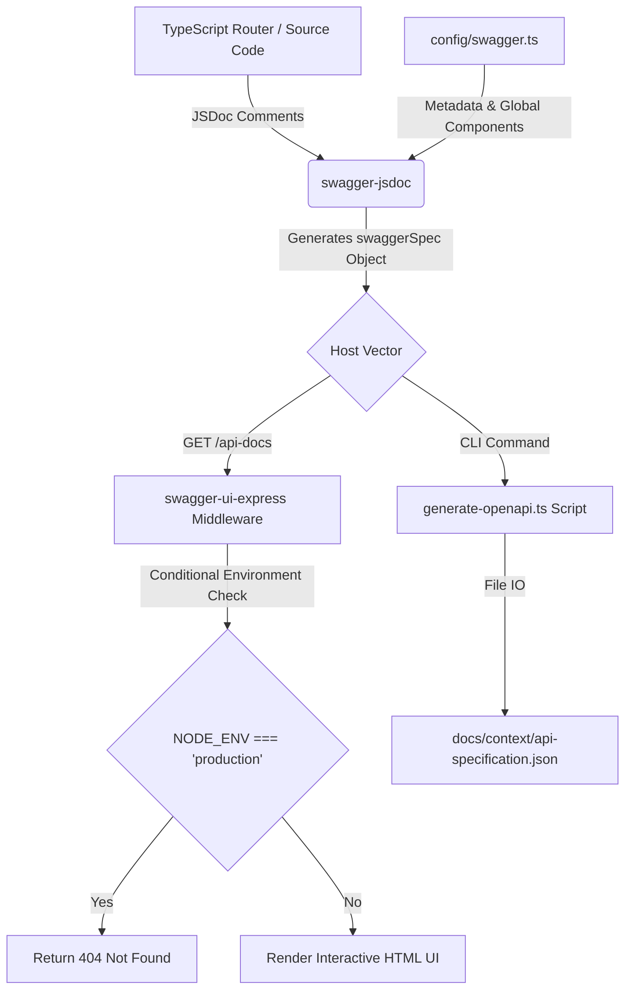
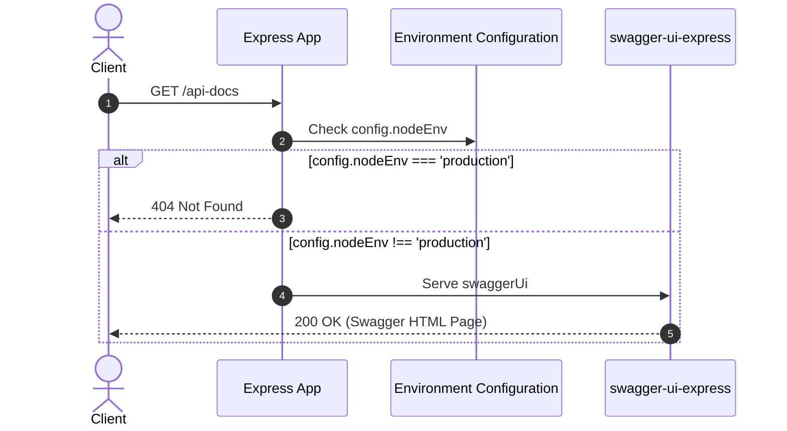

# API Specification Generation Architecture Spec

This document details the architecture, design choices, and security considerations for the automated OpenAPI/Swagger specification generation and interactive UI hosting.

---

## 1. Architectural Overview

To prevent documentation drift as handlers and models evolve, the codebase utilizes inline JSDoc OpenAPI 3.0.0 annotations parsed dynamically by `swagger-jsdoc` at runtime. The architecture supports two presentation vectors:
1. **Interactive Swagger UI**: Exposes an interactive documentation dashboard at `GET /api-docs` in non-production environments (`development`, `test`).
2. **Static JSON Export**: Resolves files to format a standalone `api-specification.json` for stakeholder reviews, frontend stub generation, and CI/CD contract tests.



---

## 2. API Contract Specification

All route endpoints enforce session-scoped access and data isolation via cookie-based authentication, which is represented in the specification:

### Authentication Scheme
```yaml
components:
  securitySchemes:
    CookieAuth:
      type: apiKey
      in: cookie
      name: session_token
      description: Signed session token cookie.
```

### Shared Components & Schemas
- **`DocumentStatusObject`**: Standardizes the document processing fields (`documentId`, `filename`, `mimeType`, `fileSizeBytes`, `status`, `progressPct`, `processedChunks`, `totalChunks`, `errorCode`, `errorMessage`, `createdAt`).
- **`ErrorResponse`**: Standardizes app error responses returned by the global Express error-handler middleware, including a descriptive error key and error message.

---

## 3. Environment-Aware Security Controls

Exposing API specs in production environments leaks metadata about backend topology and exposes vectors for probing vulnerabilities. To secure production workloads:
* **Conditional Routing Middleware**: The Express router evaluates `config.nodeEnv` before initializing `swagger-ui-express`.
* If `NODE_ENV === 'production'`, all calls to `/api-docs` short-circuit to a lightweight response helper returning `404 Not Found`, bypass database pool requests, and eliminate memory footprint overhead.



---

## 4. Verification and Enforcement

* **CLI Compilation Target**: Exposes `"api:docs:generate"` which runs `ts-node src/scripts/generate-openapi.ts` to output [api-specification.json](file:///Users/parth/RAG/Document%20Intelligence%20Platform/docs/context/api-specification.json).
* **Automated Tests**: Integration tests in [swagger.test.ts](file:///Users/parth/RAG/Document%20Intelligence%20Platform/apps/api/src/tests/swagger.test.ts) spin up server instances under mock `process.env.NODE_ENV` contexts to verify UI routing and production-lock configurations automatically in testing pipelines.
