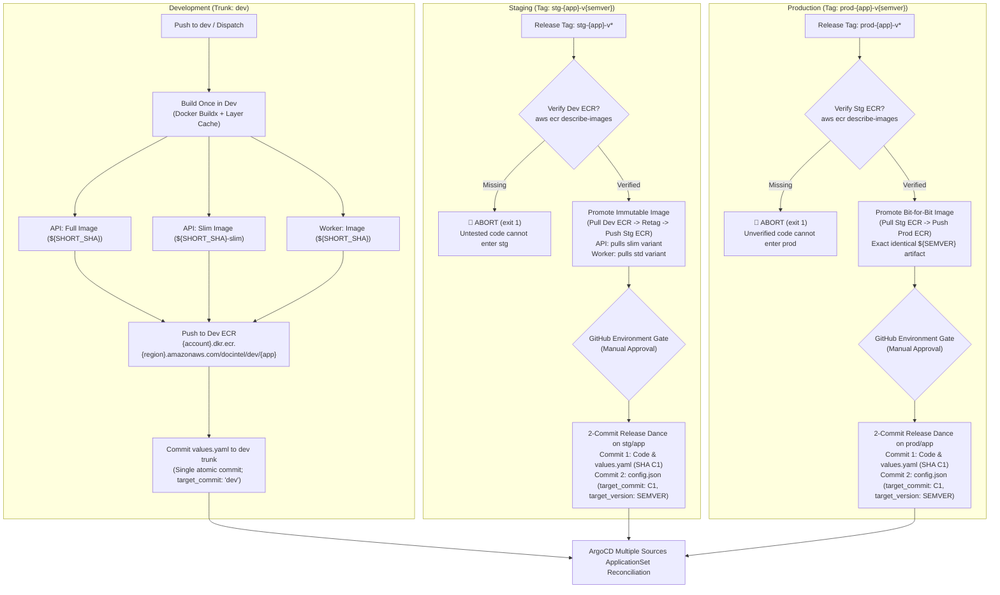
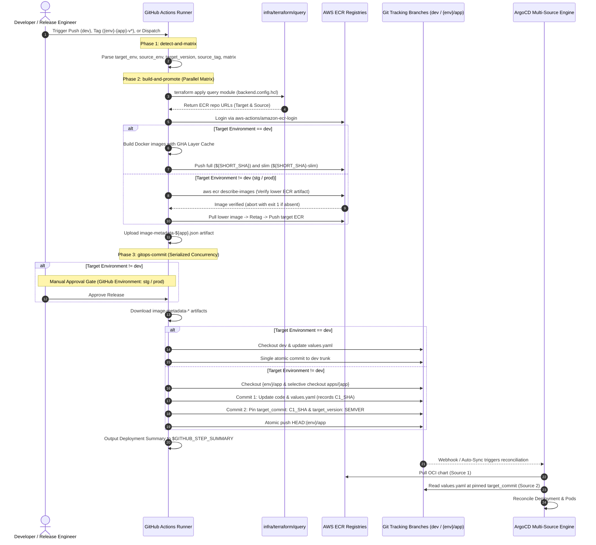

# API & Worker Microservices Multi-Environment CI/CD Specification

This specification document details the architecture, operational mechanics, and governance invariants implemented for the unified multi-environment CI/CD deployment pipeline (`.github/workflows/api-worker-cicd.yml`) covering backend microservices (`apps/api` and `apps/worker`) across `dev`, `stg`, and `prod` environments.

---

## 1. Executive Summary & Architectural Motivation

Previously, microservice builds were executed via fragmented, service-specific workflows (`api-cicd.yml`, `worker-cicd.yml`) that delegated to a monolithic reusable workflow (`reusable-docker-helm-cicd.yml`) and committed directly to legacy Helm values paths (`infra/k8s/helm/<service>/values.dev.yaml`). This legacy setup presented critical vulnerabilities:

1. **Rebuild Anti-Pattern**: Releases to staging or production recompiled Docker containers from scratch, violating artifact immutability and risking production drift.
2. **Coupled Workflows**: Separate workflows made coordinating simultaneous multi-service releases clumsy and prone to stale git reference collisions.
3. **Branch Overwrite & Git Contention**: Concurrency locking was non-standardized across services, causing git ref locking failures when Helm or microservice workflows committed simultaneously.
4. **GitOps Drift**: Direct commits to legacy Helm chart paths bypassed the ArgoCD Multi-Source ApplicationSet architecture established in Task 505.

### Architectural Solution
Task 507 consolidates container deployment into a unified, tag-driven, multi-environment workflow (`.github/workflows/api-worker-cicd.yml`) that implements strict **Build Once in Dev, Promote Identical Immutable Images to Stg/Prod**, dual image variant strategies for API, fail-fast lower-environment verification, non-destructive selective checkouts on `{env}/app`, and 2-commit immutable pinned release git tracking.

---

## 2. Core Architectural Principles & Invariants



### 2.1 Build Once in Dev, Promote Identical Immutable Images
* **Strict Docker Build Boundary**: Docker images are compiled **only in `dev`**. Staging and production release jobs strictly forbid compiling from `Dockerfile`.
* **Cryptographic Image Immutability**: Higher environments pull the exact tested image layers from the lower environment ECR repository (`dev -> stg`, `stg -> prod`), retag, and push to the target environment ECR.
* **Zero Binary Drift**: What was verified by QA in staging is byte-for-byte identical to what runs in production.

### 2.2 Dual Image Variant Strategy for API (`full` vs `slim`)
* **`apps/api/Dockerfile` Target**: Uses multi-stage builds parameterized by `ARG ENVIRONMENT=dev`.
  * **Full Variant (`ENVIRONMENT=dev`)**: Generates and packages Swagger UI (`npm run api:docs:generate`) for interactive developer documentation. Tagged `${SHORT_SHA}`.
  * **Slim Variant (`ENVIRONMENT=prod`)**: Strips Swagger UI (`npm uninstall swagger-ui-express`) and outputs an empty JSON spec (`{}`), minimizing container image attack surface and runtime dependencies. Tagged `${SHORT_SHA}-slim`.
* **Worker Variant**: `apps/worker` does not expose an HTTP documentation interface; it compiles a single standard runner image tagged `${SHORT_SHA}`.
* **Canonical Promotion**: When promoting `api` to staging, the pipeline explicitly pulls the tested **`${SHORT_SHA}-slim`** image from Dev ECR and tags it as the clean `${SEMVER}` release artifact in Staging ECR.

### 2.3 Fail-Fast Lower-Environment ECR Verification
To prevent deploying unverified commits or broken release tags directly into higher environments, the pipeline queries the lower-environment repository using `aws ecr describe-images` before any promotion logic:
* Staging release checks Dev ECR for `${SHORT_SHA}-slim` (API) or `${SHORT_SHA}` (Worker).
* Production release checks Staging ECR for `${SEMVER}`.
* **Hard Stop**: If the artifact does not exist, the pipeline exits immediately with exit code `1` and an actionable error:
  `::error::Prerequisite image not found in lower ECR! Untested/unverified code cannot enter environment! Deploy to lower environment first.`

### 2.4 Non-Destructive Selective Checkouts on `{env}/app`
Because `api` and `worker` are backend sibling microservices sharing the release tracking branch `{env}/app` (e.g. `stg/app` and `prod/app`):
* The release job **never** executes `git rm -rf .` or wipes working trees.
* The job executes selective checkouts targeting strictly the microservice under release:
  ```bash
  git checkout "${TAG_NAME}" -- "apps/${APP_NAME}"
  ```
* Sibling microservice code, directory trees, and GitOps configurations (`infra/k8s/argocd/${env}/`) remain completely intact.

### 2.5 Clean GitOps Commit Optimization
* **In `dev` (Live Trunk Optimization)**:
  * Updates `container.image.repository` and `container.image.tag` in `infra/k8s/argocd/dev/${app}/values.yaml`.
  * Single atomic commit to `dev`.
  * `config.json` is left untouched (`"target_commit": "dev"` remains intact). ArgoCD ApplicationSet tracks the live trunk branch pointer.
* **In `stg` / `prod` (2-Commit Immutable Pinned Pattern)**:
  * Application manifests must be pinned to the exact commit SHA where `values.yaml` is located, while the ApplicationSet discovery mechanism tracks the moving `{env}/app` branch tip.
  * **Commit 1 (Code & Manifests)**: Stages `apps/${app}` and `infra/k8s/argocd/${env}/${app}/values.yaml` $\rightarrow$ records commit SHA `C1_SHA`.
  * **Commit 2 (Pinned Pointer)**: Updates `infra/k8s/argocd/${env}/${app}/config.json` with `"target_commit": "${C1_SHA}"` and human-auditable `"target_version": "${SEMVER}"`.
  * **Single Atomic Push**: Both commits are pushed together in a single `git push origin HEAD:"${env}/app"`.
* **JSON Auditing Standard**: Standard JSON does not permit `//` or `/* */` comments. Go's `encoding/json` and `jq` in ArgoCD fail if comments are present. Human auditability is achieved via the dedicated JSON field `"target_version": "${SEMVER}"`.

### 2.6 Global Serialized Git Concurrency
To prevent stale-reference rejections and race conditions across multiple pipelines pushing to the same branch:
* **Dev Environment**: `group: git-commit-dev` (shared between `helm-cicd.yml` and `api-worker-cicd.yml`).
* **Higher Environments**: `group: git-commit-${env}-app` (serializes releases targeting `stg/app` and `prod/app`).

---

## 3. Workflow Trigger Configuration & Event Flow

The pipeline is registered at `.github/workflows/api-worker-cicd.yml` and triggers on three distinct modalities:

```yaml
on:
  push:
    branches:
      - dev
    paths:
      - 'apps/api/**'
      - 'apps/worker/**'
    tags:
      - 'stg-api-v*'
      - 'stg-worker-v*'
      - 'prod-api-v*'
      - 'prod-worker-v*'
  workflow_dispatch:
    inputs:
      app:
        description: 'Select application to build and deploy (dev only)'
        required: true
        type: choice
        options:
          - 'all'
          - 'api'
          - 'worker'
        default: 'all'
      image_to_deploy:
        description: 'Select API image variant to deploy to dev (applies to api only)'
        required: false
        type: choice
        options:
          - 'full'
          - 'slim'
        default: 'full'
```

---

## 4. Phase-by-Phase Technical Mechanics



### 4.1 Phase 1: `detect-and-matrix` (Resolution Engine)
* **Tag Parsing**:
  * Tag pattern: `{env}-{app}-v{semver}` (e.g. `stg-api-v1.2.0`, `prod-worker-v2.0.1`).
  * `TARGET_ENV=$(echo "$TAG_NAME" | cut -d'-' -f1)`
  * `APP=$(echo "$TAG_NAME" | cut -d'-' -f2)`
  * `SEMVER=$(echo "$TAG_NAME" | sed -E 's/^[a-z]+-(api|worker)-v//')`
  * `MATRIX="[\"$APP\"]"` (strictly 1 element for tag releases).
  * Promotion tags:
    * `stg`: `SOURCE_ENV="dev"`, `TARGET_VERSION="$SEMVER"`. API uses `SOURCE_TAG="${SHORT_SHA}-slim"`; Worker uses `SOURCE_TAG="${SHORT_SHA}"`.
    * `prod`: `SOURCE_ENV="stg"`, `TARGET_VERSION="$SEMVER"`, `SOURCE_TAG="$SEMVER"`.
* **Push to `dev` Parsing**:
  * Evaluates changed microservice directories via `git diff --name-only HEAD~1 HEAD`:
    * If only `apps/api/**` changed $\rightarrow$ `MATRIX="[\"api\"]"`
    * If only `apps/worker/**` changed $\rightarrow$ `MATRIX="[\"worker\"]"`
    * If both changed $\rightarrow$ `MATRIX="[\"api\", \"worker\"]"`
  * `TARGET_ENV="dev"`, `TARGET_VERSION="${SHORT_SHA}"`.
* **Workflow Dispatch Parsing**:
  * Allows selecting `api`, `worker`, or `all` in `dev`.
  * For `api`, supports choosing `image_to_deploy: full` or `slim`.

### 4.2 Phase 2: `build-and-promote` (Matrix Build & Promotion)
* **Terraform Remote State Query**:
  * Runs inside `infra/terraform/query` with `-var-file="../aws/environments/${ENV}/backend.config.hcl"`.
  * Extracts ECR repo URLs ending in `/${APP}`.
  * In `stg` and `prod`, also queries `SOURCE_ENV` backend config to retrieve the lower-environment repository URL.
  * In local ACT mode (`env.ACT`), seamlessly injects mock repository URLs to enable offline simulation.
* **Docker Build & Push (Dev)**:
  * Uses `docker/setup-buildx-action` and `docker/build-push-action` with GitHub Actions cache (`type=gha,mode=max`).
  * Compiles both `full` and `slim` for `api`.
  * Compiles standard for `worker`.
* **Lower-Environment Verification & Promotion (Stg & Prod)**:
  * Verifies artifact existence via `aws ecr describe-images`.
  * Executes `docker pull` $\rightarrow$ `docker tag` $\rightarrow$ `docker push`.
* **Metadata Export**:
  * Writes `/tmp/metadata/image-${APP}.json`:
    ```json
    {
      "app": "${APP}",
      "image_tag": "${DEPLOYED_TAG}",
      "ecr_repo": "${TARGET_REPO_URL}"
    }
    ```
  * Uploads artifact `image-metadata-${APP}` via `actions/upload-artifact`.

### 4.3 Phase 3: `gitops-commit` (Serialized GitOps Downstream Release)
* **Environment Gate**: Bound to `environment: ${{ needs.detect-and-matrix.outputs.env }}`. Automatically halts on `stg` and `prod` until designated team reviewers grant manual approval.
* **Concurrency Grouping**:
  ```yaml
  concurrency:
    group: git-commit-${{ needs.detect-and-matrix.outputs.env == 'dev' && 'dev' || format('{0}-app', needs.detect-and-matrix.outputs.env) }}
    cancel-in-progress: false
  ```
* **Git Updates**:
  * Uses `sed -i -E` to replace `repository:` and `tag:` fields in `values.yaml`.
  * Uses `jq -n` to generate `config.json` with pinned commit SHA and version:
    ```json
    {
      "app": "api",
      "target_commit": "c1a2b3c4d5e6f7a8b9c0d1e2f3a4b5c6d7e8f9a0",
      "target_version": "1.0.0"
    }
    ```
  * In `dev`: single commit to `dev` trunk.
  * In `stg`/`prod`: 2-commit dance on `{env}/app` with rebase pull and atomic push.
* **Deployment Summary (`$GITHUB_STEP_SUMMARY`)**:
  * Outputs release metadata table, microservice image table, and ArgoCD reconciliation guidance directly into the GitHub Actions run summary.

---

## 5. Integration with ArgoCD Multiple Sources

The GitOps repository layout and the ArgoCD `ApplicationSet` (`infra/terraform/k8s/manifests/argocd-applicationset.yaml`) interact with the commits generated by this workflow:

```text
infra/k8s/argocd/
├── dev/
│   ├── api/
│   │   ├── config.json         # { "app": "api", "target_commit": "dev" }
│   │   └── values.yaml         # Updated by dev commits (tag: ${SHORT_SHA})
│   └── worker/
│       ├── config.json         # { "app": "worker", "target_commit": "dev" }
│       └── values.yaml         # Updated by dev commits (tag: ${SHORT_SHA})
├── stg/
│   ├── api/
│   │   ├── config.json         # { "app": "api", "target_commit": "${C1_SHA}", "target_version": "${SEMVER}" }
│   │   └── values.yaml         # Pinned values at commit ${C1_SHA}
│   └── worker/ ...
└── prod/
    ├── api/ ...
    └── worker/ ...
```

### ArgoCD Multiple Sources Reconciliation
```yaml
spec:
  sources:
    # Source 1: OCI Helm Chart from Amazon ECR (Managed by helm-cicd.yml)
    - repoURL: '${ecr_registry_url}/${project_name}/${environment}'
      chart: '{{chart_name}}'
      targetRevision: '{{chart_version}}'
    # Source 2: Values & Code from Git (Managed by api-worker-cicd.yml)
    - repoURL: '${github_repository_url}'
      targetRevision: '{{target_commit}}'
      ref: app_values
```
1. **Source 1 (OCI Chart)**: ArgoCD pulls the packaged Helm template from Amazon ECR pinned to `{{chart_version}}`.
2. **Source 2 (Git Values)**: ArgoCD pulls `values.yaml` from Git.
   * In `dev`: `{{target_commit}}` resolves to `"dev"`, continuously tracking latest trunk changes.
   * In `stg` & `prod`: `{{target_commit}}` resolves to exact immutable commit hash `"${C1_SHA}"`. Even if new commits arrive on the branch, ArgoCD does not deploy them until `config.json` is explicitly updated.

---

## 6. Local Testing & Verification Strategy (`act`)

Local simulation fixtures are located under `.github/workflows/api-worker-cicd/`:

```text
.github/workflows/api-worker-cicd/
├── Taskfile.yaml
└── events/
    ├── push-dev.json           # Push to dev touching apps
    ├── dev-all.json            # Manual workflow_dispatch selecting all apps
    ├── tag-stg-api.json        # Release tag: stg-api-v1.0.0
    └── tag-prod-worker.json    # Release tag: prod-worker-v1.0.0
```

### Verification Commands
Developers can simulate GitHub Actions execution locally without cloud billing or AWS credentials:

```bash
# 1. Inspect workflow structure
task -d .github/workflows/api-worker-cicd list

# 2. Simulate dev push
task -d .github/workflows/api-worker-cicd test-push-dev

# 3. Simulate dev manual dispatch
task -d .github/workflows/api-worker-cicd test-dispatch-dev

# 4. Simulate staging tag release
task -d .github/workflows/api-worker-cicd test-tag-stg

# 5. Simulate production tag release
task -d .github/workflows/api-worker-cicd test-tag-prod
```

---

## 7. Operational Knowledge Transfer & Runbook

### Releasing a New Version to Staging
1. Verify that changes have been merged into `dev` and tested in development.
2. Ensure the dev pipeline has completed and the container image exists in Dev ECR.
3. Cut a semantic release tag from the tested commit on `dev`:
   ```bash
   git checkout dev
   git pull origin dev
   git tag stg-api-v1.0.0
   git push origin stg-api-v1.0.0
   ```
4. The workflow will verify the image in Dev ECR, copy it to Staging ECR, pause for manual review, and execute the 2-commit release dance on `stg/app`.
5. Review and approve the deployment in GitHub Actions under the `stg` environment gate.

### Releasing from Staging to Production
1. Confirm that the staging deployment has passed verification in the staging cluster.
2. Cut the corresponding production tag pointing to the exact same commit:
   ```bash
   git tag prod-api-v1.0.0
   git push origin prod-api-v1.0.0
   ```
3. The workflow will verify the image in Staging ECR, copy the identical artifact to Production ECR, pause for production review, and commit to `prod/app`.
4. Review and approve the deployment in GitHub Actions under the `prod` environment gate.

### Troubleshooting: `Prerequisite image not found in lower ECR!`
* **Cause**: A release tag was pushed before the commit was deployed to the lower environment.
* **Resolution**: Deploy the commit to `dev` first to generate the base image, verify it appears in Dev ECR, and re-trigger the release tag.
