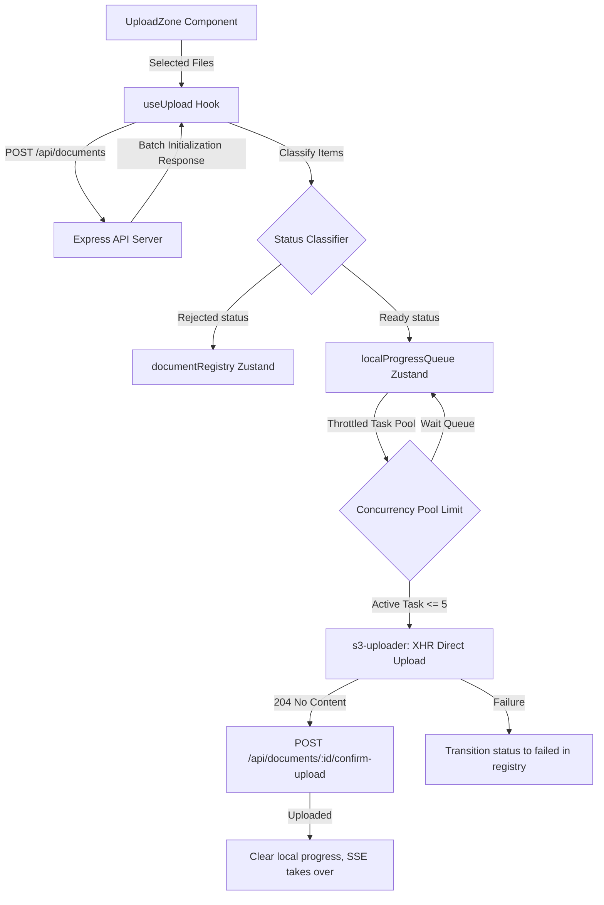

# Batch Upload Queue & S3 Ingestion Specification

This document details the architectural design, implementation parameters, and error-mitigation paths of the batch upload engine implemented in Tasks F3.2 and F3.3.

---

## 1. Core Architecture

The frontend uses `useUpload` (a custom React hook) to orchestrate batch uploads. It coordinates with the Zustand store (`localProgressQueue`, `documentRegistry`), interacts with the backend API to initialize uploads, and calls the direct S3 multipart POST engine (`s3-uploader.ts`) before confirming status changes.

---

## 2. Queue Classification Flow

When files are passed to `useUpload`, they undergo two phases of classification and verification:

1. **Batch Registration & Initialization (`POST /api/documents`)**:
   - The hook registers the entire batch of files in a single request.
   - The backend validates session limits (cumulative 50MB storage quota and maximum 5 concurrent processing documents).
   - If the session limit is exceeded, the server responds with `400 storage_quota_exceeded` or `429 rate_limit_exceeded`. The hook intercepts these and shows a global modal dialog box.

2. **Per-File Evaluation**:
   - The backend returns an array of `results`, one for each document in the batch.
   - **`rejected` Items**: Added directly to `documentRegistry` with a status of `failed`, carrying the specific validation error (`invalid_mime_type` or `file_too_large`). These are rendered with red inline error messages below the filename.
   - **`ready` Items**: Added to the `localProgressQueue` with a status of `initializing`. These proceed to the concurrent upload queue.

---

## 3. S3 Direct Upload Engine (`s3-uploader.ts`)

Direct file transfer to S3 uses a custom XMLHttpRequst module rather than standard `fetch` to enable native upload progress tracking:

- **FormData Order Compliance**:
  AWS S3 Presigned POST requires that all policy fields (e.g., `key`, `policy`, `signature`, `x-amz-*`) are appended to the `FormData` body *exactly in the order received*, and the raw `file` payload itself must be appended *last*. Placing the file field before policy fields causes S3 to reject the signature, throwing `AccessDenied` (403). The engine programmatically ensures this ordering by iterating over `uploadFields` keys before appending the file.
  
- **XMLHttpRequest Progress Tracking**:
  By binding to `xhr.upload.onprogress`, the engine listens to native upload progress callbacks, computing the percentage complete and calling `onProgress(percent)` which updates the Zustand store (`updateLocalProgressPct`).

- **Confirmation Handback**:
  Upon successful completion (S3 returns `204 No Content` for presigned POST requests), the hook invokes `POST /api/documents/:id/confirm-upload` to transition the status of the document from `pending_upload` to `uploaded`. If this succeeds, the local queue item is cleared, allowing the backend SSE pipeline to govern subsequent processing status broadcasts.

---

## 4. Concurrency Pool Controller

To prevent resource exhaustion and browser rate-limiting, uploads are throttled to a maximum of 5 concurrent operations:

- **Asynchronous Queue Loop**:
  - The orchestrator maintains an array of `tasks` (ready files) and an `activeCount` counter.
  - Up to 5 concurrent promises are kicked off.
  - Each task executes, uploading files to S3 and invoking `confirm-upload` on completion.
  - When a task resolves, it decrements `activeCount` and recursively triggers the next available task in the queue, ensuring the promise pool is always saturated at exactly 5 (or fewer) active uploads.
  - By using `await runNext()`, the pool is guaranteed to resolve the batch promise only when all tasks are complete.

---

## 5. UI Elements & Integration

### Interactive Upload Zone
- Monitored by the Zustand store. If the number of active uploads (local progress items + non-terminal backend items) is $\ge 5$, the zone locks itself, disabling clicks/drops and showing a warning banner.

### Inline Errors
- Failed items in `documentRegistry` display their specific validation or network error message inline on the dashboard file list, allowing users to troubleshoot individual rejections.

### Global Error Dialog Modal
- Exposes a glassmorphic dialog modal overlay when a batch registration fails due to session-level constraints (quota/rate limits), allowing users to dismiss and resolve the issue.
