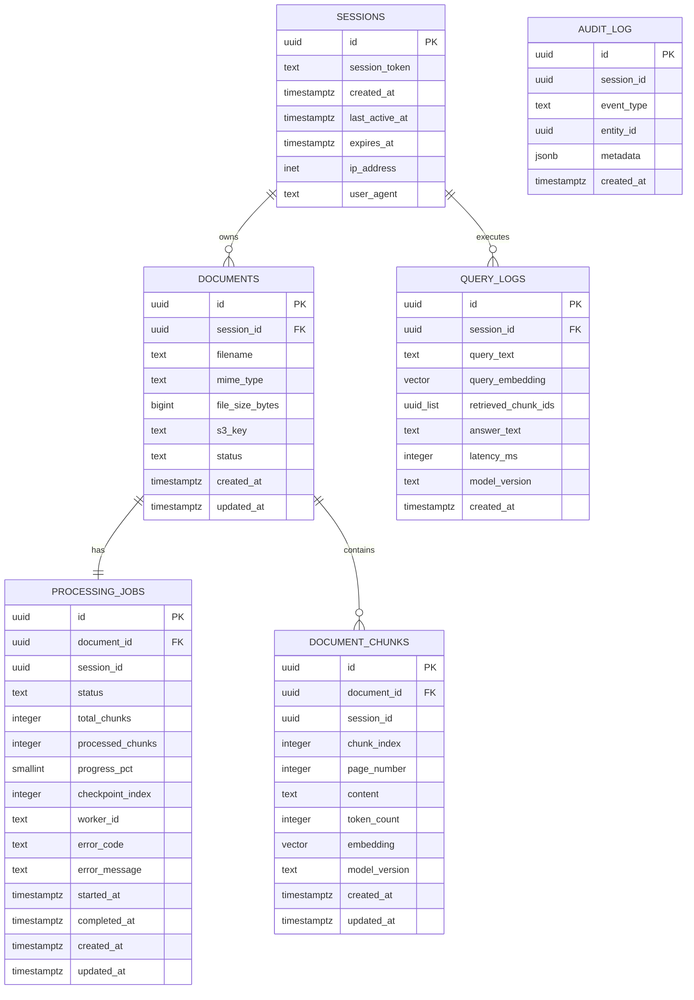

# Database Schema Specification

This document details the database schema configuration created in Task 101, illustrating the relationships, indices, pgvector configurations, and real-time triggers.

## 1. Entity Relationship Diagram (ERD)



---

## 2. Relational Schema & Cascading Deletes

All tables directly linked to a user's active session are configured with foreign key cascades pointing to the `sessions` table. This ensures clean purging of session data without leaving orphan rows:
* `sessions` $\rightarrow$ `documents` $\rightarrow$ `document_chunks` (ON DELETE CASCADE)
* `sessions` $\rightarrow$ `documents` $\rightarrow$ `processing_jobs` (ON DELETE CASCADE)
* `sessions` $\rightarrow$ `query_logs` (ON DELETE CASCADE)

---

## 3. pgvector Configuration & HNSW Indexing

The embedding columns (`document_chunks.embedding` and `query_logs.query_embedding`) are configured with a size of **1024 dimensions**, matching the Amazon Bedrock Titan Embeddings V2 model specifications.

To optimize the tenancy-scoped cosine similarity search, we implement:
* **HNSW Index**: Configured on `document_chunks(embedding)` using `vector_cosine_ops`.
* **Hyperparameters**: Set to `m = 16` and `ef_construction = 64` to balance search speed and recall during ingestion.
* **Compound Tenancy Filtering**: Relational indices are applied on `session_id` to allow quick `WHERE session_id = $1` filters before executing the vector distance calculation (`embedding <=> $2::vector`).

```sql
CREATE INDEX "document_chunks_embedding_hnsw_idx" 
ON "document_chunks" 
USING hnsw (embedding vector_cosine_ops) 
WITH (m = 16, ef_construction = 64);
```

---

## 4. Real-Time Processing Trigger

To support real-time user-facing ingestion progress indicators, a PostgreSQL `LISTEN/NOTIFY` trigger is configured on the `processing_jobs` table. When the Python worker makes a database batch checkpoint update, the DB issues a `pg_notify` message on a **session-scoped channel** containing the updated document metadata. The API server listens on the channel specific to the connected user's session and streams frames directly to the client via Server-Sent Events (SSE).

**Channel naming convention**: `progress_{sessionId}` where hyphens in the UUID are replaced with underscores, producing a valid unquoted PostgreSQL identifier (e.g., `progress_550e8400_e29b_41d4_a716_446655440000`). This ensures each SSE connection receives only its own session's events — no Express-side session filtering is required.

### Trigger Definition
```sql
CREATE OR REPLACE FUNCTION notify_progress_channel()
RETURNS trigger AS $$
BEGIN
  PERFORM pg_notify(
    'progress_' || replace(NEW.session_id::text, '-', '_'),
    json_build_object(
      'document_id',      NEW.document_id,
      'status',           NEW.status,
      'progress_pct',     NEW.progress_pct,
      'processed_chunks', NEW.processed_chunks,
      'total_chunks',     NEW.total_chunks,
      'error_code',       NEW.error_code,
      'error_message',    NEW.error_message
    )::text
  );
  RETURN NEW;
END;
$$ LANGUAGE plpgsql;

CREATE TRIGGER processing_jobs_notify
AFTER UPDATE ON processing_jobs
FOR EACH ROW EXECUTE FUNCTION notify_progress_channel();
```

> **Note on `session_id` in payload**: The session ID is encoded in the channel name itself. It does NOT need to appear in the JSON payload. The payload carries only document-level progress fields.

> **Migration history**: The initial migration (`20260621133135_init`) deployed this trigger with the legacy global channel name `'progress_channel'`. Task 105 introduces a new Prisma migration that uses `CREATE OR REPLACE FUNCTION` to overwrite the trigger function with the session-scoped channel name above. The trigger binding (`CREATE TRIGGER`) does not need to be recreated.

The Express API `LISTEN`s to `progress_{sessionId}` (using `LISTEN progress_550e8400_e29b_41d4_a716_446655440000`) on a dedicated pg Pool client per SSE connection. On client disconnect, the handler issues `UNLISTEN progress_{sessionId}` and releases the pg connection back to the pool.

---

## 5. Security & Performance Impact

* **Data Leakage Mitigation**: Session IDs act as logical database-level security boundaries. Query scopes are isolated by ensuring every SELECT includes `WHERE session_id = $1`.
* **Write Amplification Mitigation**: Progress updates are batched (once per 50 chunks) to reduce the database write overhead and trigger firing frequency.
* **No Raw SQL**: Standard read/write operations utilize the Prisma Client (TypeScript) and SQLAlchemy (Python) to prevent SQL injection vulnerabilities. The migration SQL is the only location containing raw SQL constructs for system-level triggers.
