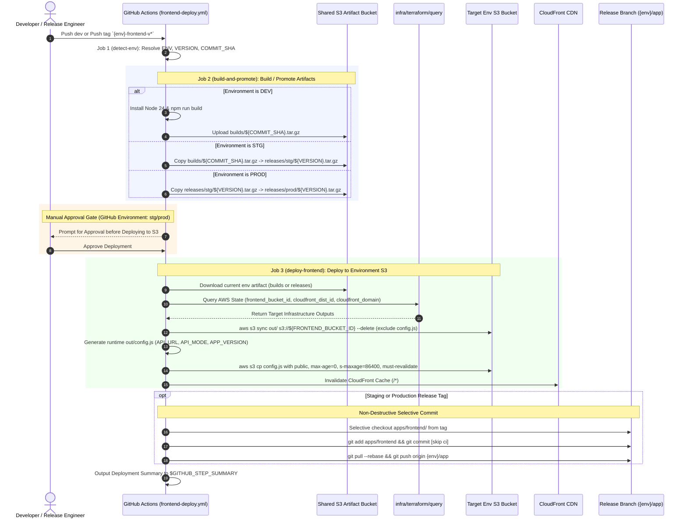

# Frontend Multi-Environment CI/CD Specification

This specification document details the multi-environment CI/CD deployment pipeline architecture for the React/Next.js frontend application (`apps/frontend`) in `.github/workflows/frontend-deploy.yml` across `dev`, `stg`, and `prod` environments.

---

## 1. Executive Summary & Architectural Motivation

The frontend client is statically exported (`output: 'export'`) and served from AWS S3 via Amazon CloudFront. In traditional static builds, environment variables prefixed with `NEXT_PUBLIC_*` are statically evaluated and inlined into JavaScript chunks at compile time. This poses severe challenges for multi-environment cloud-native deployments:

1. **Rebuild Anti-Pattern**: Compiling new bundles per environment violates artifact immutability, creating potential differences between staging and production.
2. **Configuration Coupling**: Baking backend API endpoints into static bundles requires redeployment of assets even when only environment URLs change.
3. **Cache Invalidation Delays**: Aggressive browser caching can lock clients into outdated bundles or stale API endpoints.

### Architectural Solution
The frontend CI/CD pipeline enforces the strict **"Build once in dev, promote identical immutable artifacts to stg/prod"** pattern:
- The Next.js application is compiled strictly once per commit on `dev`.
- Build archives are packaged into a centralized S3 artifact bucket (`vars.ARTIFACT_BUCKET_NAME`).
- Staging and production releases promote the exact immutable tarball without re-compilation.
- Runtime configuration is decoupled into an un-hashed `/config.js` script generated dynamically at deploy time.
- Releases to higher environments selectively update the consolidated `{env}/app` tracking branch without destructive working tree wipes.
- Deployment operations use global serialized concurrency locking (`git-commit-${env}-app`) to prevent simultaneous git push conflicts.

---

## 2. Core Architectural Principles & Invariants

```mermaid
flowchart TD
    subgraph Dev_Environment ["Development (Trunk: dev)"]
        DevCommit["Push to dev / Dispatch"] --> BuildDev["Compile Once in Dev<br/>(npm run build -> out/)"]
        BuildDev --> PackDev["Package out/ as tar.gz"]
        PackDev --> UploadDev["Upload to Artifact Bucket<br/>s3://${ARTIFACT_BUCKET_NAME}/builds/${COMMIT_SHA}.tar.gz"]
        UploadDev --> DeployDev["Deploy to Dev S3 & Invalidate CloudFront"]
    end

    subgraph Staging_Environment ["Staging (Tag: stg-frontend-v*)"]
        StgTag["Release Tag: stg-frontend-v*"] --> StgVerify{"Verify Dev Build?<br/>aws s3 ls"}
        StgVerify -->|"Missing"| StgFail["🛑 ABORT (exit 1)<br/>Unbuilt commit cannot enter stg"]
        StgVerify -->|"Verified"| StgCopy["Promote Immutable Artifact<br/>Copy builds/${COMMIT_SHA}.tar.gz -> releases/stg/${VERSION}.tar.gz"]
        StgCopy --> StgApproval{"GitHub Environment Gate<br/>(Manual Approval: stg)"}
        StgApproval --> DeployStg["Deploy to Staging S3 & Invalidate CloudFront"]
        DeployStg --> StgTrack["Commit to stg/app<br/>(Selective checkout apps/frontend/)"]
    end

    subgraph Production_Environment ["Production (Tag: prod-frontend-v*)"]
        ProdTag["Release Tag: prod-frontend-v*"] --> ProdVerify{"Verify Staging Release?<br/>aws s3 ls"}
        ProdVerify -->|"Missing"| ProdFail["🛑 ABORT (exit 1)<br/>Unverified artifact cannot enter prod"]
        ProdVerify -->|"Verified"| ProdCopy["Promote Immutable Artifact<br/>Copy releases/stg/${VERSION}.tar.gz -> releases/prod/${VERSION}.tar.gz"]
        ProdCopy --> ProdApproval{"GitHub Environment Gate<br/>(Manual Approval: prod)"}
        ProdApproval --> DeployProd["Deploy to Production S3 & Invalidate CloudFront"]
        DeployProd --> ProdTrack["Commit to prod/app<br/>(Selective checkout apps/frontend/)"]
    end
```



### 2.1 Centralized Artifact Bucket & Immutable Promotion Hierarchy
Pre-compiled static export bundles (`out/`) are managed through a centralized S3 artifact store (`vars.ARTIFACT_BUCKET_NAME`):

```text
s3://${ARTIFACT_BUCKET_NAME}/
├── builds/
│   └── ${COMMIT_SHA}.tar.gz           # Published strictly once by dev CI build
└── releases/
    ├── stg/
    │   └── ${VERSION}.tar.gz          # Promoted from builds/${COMMIT_SHA}.tar.gz upon stg tag
    └── prod/
        └── ${VERSION}.tar.gz          # Promoted from releases/stg/${VERSION}.tar.gz upon prod tag
```

* **Dev**: Compiles source code with Node 24 (`npm run build`), creates `out/`, packages it into `frontend.tar.gz`, and uploads to `builds/${COMMIT_SHA}.tar.gz`.
* **Staging**: Verifies that `builds/${COMMIT_SHA}.tar.gz` exists, then copies it to `releases/stg/${VERSION}.tar.gz`.
* **Production**: Verifies that `releases/stg/${VERSION}.tar.gz` exists, then copies it to `releases/prod/${VERSION}.tar.gz`. Zero rebuilding.

### 2.2 Decoupled Runtime Configuration (`config.js`)
* Static bundles contain zero environment-specific API endpoints or feature toggles.
* The pipeline dynamically generates `config.js` on the runner prior to S3 upload:
  ```javascript
  window.__APP_CONFIG__ = {
    API_URL: "https://${CLOUDFRONT_DOMAIN}/api",
    API_MODE: "${TARGET_MODE}",
    APP_VERSION: "${VERSION}"
  };
  ```
* Injected into `<head>` in `apps/frontend/src/app/layout.tsx` via:
  ```tsx
  <Script src="/config.js" strategy="beforeInteractive" />
  ```
  `strategy="beforeInteractive"` ensures the configuration script runs **synchronously before any React hydration, component mounts, or API client initializations execute**.

### 2.3 Strict Caching & Invalidation Semantics
Deployment to the environment S3 bucket executes in two decoupled steps:
1. **Hashed Assets (Immutable Cache)**:
   ```bash
   aws s3 sync apps/frontend/out "s3://${FRONTEND_BUCKET_ID}" \
     --delete \
     --exclude "config.js"
   ```
   Hashed static chunks (`_next/static/**`) are cached immutably.
2. **Runtime Configuration (Edge-Cached + Browser-Revalidated)**:
   ```bash
   aws s3 cp apps/frontend/out/config.js "s3://${FRONTEND_BUCKET_ID}/config.js" \
     --content-type "application/javascript" \
     --cache-control "public, max-age=0, s-maxage=86400, must-revalidate"
   ```
   CloudFront edge points cache `config.js` for up to 24 hours (`s-maxage=86400`), but browser clients revalidate on every request (`max-age=0, must-revalidate`).
3. **CloudFront CDN Cache Invalidation**:
   The workflow purges edge locations with `aws cloudfront create-invalidation --paths "/*"`, ensuring newly released configurations and HTML entrypoints are served instantly.

### 2.4 Consolidated Release Tracking Branch (`{env}/app`)
* Higher environment releases (`stg` and `prod`) commit to the consolidated application release branch **`{env}/app`** (e.g. `stg/app` and `prod/app`), alongside backend services (`api` and `worker`).
* **Non-Destructive Invariant**: The workflow **never** runs `git rm -rf .` or wipes the branch. It selectively checks out only `apps/frontend` from the release tag and stages only `apps/frontend`.
* Sibling microservice code (`apps/api`, `apps/worker`) and GitOps manifests (`infra/k8s/argocd/`) remain completely untouched.

### 2.5 Global Concurrency Locking
The deployment job enforces concurrency grouping aligned with the backend application pipeline:
```yaml
concurrency:
  group: git-commit-${{ needs.detect-env.outputs.env == 'dev' && 'dev' || format('{0}-app', needs.detect-env.outputs.env) }}
  cancel-in-progress: false
```
* On `dev`: `git-commit-dev`.
* On `stg`: `git-commit-stg-app`.
* On `prod`: `git-commit-prod-app`.

This guarantees that simultaneous releases (e.g. concurrent frontend and api releases to staging) queue sequentially, eliminating git ref lock collisions and push rejections.

---

## 3. End-to-End Sequence Diagram



---

## 4. Pipeline Jobs & Operational Details

### 4.1 Job 1: `detect-env` (Resolution)
* Parses tag format `{env}-frontend-v{semver}` (e.g. `stg-frontend-v1.0.0`, `prod-frontend-v1.0.0`).
* For push to `dev` or manual `workflow_dispatch`, defaults to `dev` and version `0.0.0`.
* Outputs `env`, `version`, `short_sha`, and `commit_sha`.

### 4.2 Job 2: `build-and-promote` (Artifact Store Engine)
* **Dev Environment**:
  * Installs Node.js 24 and runs `npm run build`.
  * Verifies `apps/frontend/out/` exists.
  * Archives bundle into `/tmp/frontend-${COMMIT_SHA}.tar.gz`.
  * Uploads to `s3://${ARTIFACT_BUCKET_NAME}/builds/${COMMIT_SHA}.tar.gz`.
* **Higher Environments (`stg`, `prod`)**:
  * Asserts prerequisite artifact exists in S3; aborts immediately (`exit 1`) if absent.
  * Copies immutable archive to release key (`releases/${ENV}/${VERSION}.tar.gz`).

### 4.3 Job 3: `deploy-frontend` (Publishing & Tracking)
* **Environment Gate**: Enforces manual approval gate on `stg` and `prod`.
* **Concurrency Locking**: Locks to `git-commit-${env}-app` (`git-commit-dev` for dev).
* **Downloads & Unpacks**: Downloads artifact from S3 and extracts to `apps/frontend/out`.
* **Queries Infrastructure**: Uses `infra/terraform/query` to dynamically resolve `frontend_bucket_id`, `cloudfront_domain`, and `cloudfront_distribution_id`.
* **Generates `config.js`**: Writes runtime settings to `apps/frontend/out/config.js`.
* **Synchronizes S3**: Uploads hashed assets with `--delete` (excluding `config.js`) and uploads `config.js` with revalidation headers.
* **Invalidates CloudFront**: Submits `/*` invalidation request.
* **Selective Release Tracking**: Checks out `${env}/app`, selectively extracts `apps/frontend`, commits with `release(frontend): deploy frontend ${VERSION} [skip ci]`, and pushes atomically.
* **GitHub Deployment Summary**: Appends release status and infrastructure details to `$GITHUB_STEP_SUMMARY`.

---

## 5. Local Runner Testing & Verification (`act`)

Local simulation fixtures are located under `.github/workflows/frontend-deploy/`:

```text
.github/workflows/frontend-deploy/
├── Taskfile.yaml
└── events/
    ├── dev.json
    ├── push-dev.json
    ├── tag-stg.json
    └── tag-prod.json
```

### Verification Commands
```bash
# List available jobs
task -d .github/workflows/frontend-deploy list

# Simulate push to dev
task -d .github/workflows/frontend-deploy push-dev

# Simulate manual dispatch build
task -d .github/workflows/frontend-deploy plan-dev

# Simulate staging release tag
task -d .github/workflows/frontend-deploy tag-stg

# Simulate production release tag
task -d .github/workflows/frontend-deploy tag-prod
```

---

## 6. Operational Knowledge Transfer & Runbook

### Releasing Frontend to Staging
1. Merge tested pull requests into `dev`.
2. Ensure the dev workflow has completed and the build artifact is present in `s3://${ARTIFACT_BUCKET_NAME}/builds/`.
3. Cut a staging release tag:
   ```bash
   git checkout dev && git pull origin dev
   git tag stg-frontend-v1.0.0
   git push origin stg-frontend-v1.0.0
   ```
4. Review and approve the `stg` environment gate in GitHub Actions.
5. Verify deployment at `https://${CLOUDFRONT_STG_DOMAIN}`.

### Promoting Frontend to Production
1. Confirm staging verification has passed.
2. Cut the production tag pointing to the exact same commit:
   ```bash
   git tag prod-frontend-v1.0.0
   git push origin prod-frontend-v1.0.0
   ```
3. Review and approve the `prod` environment gate in GitHub Actions.
4. Verify production deployment.
