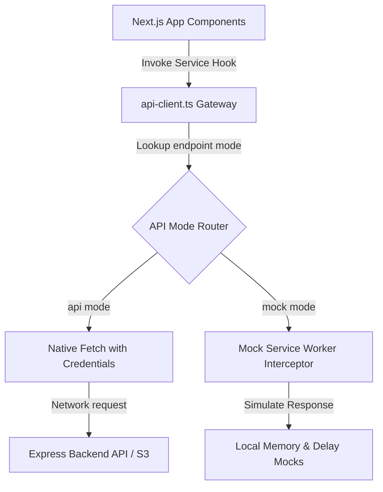
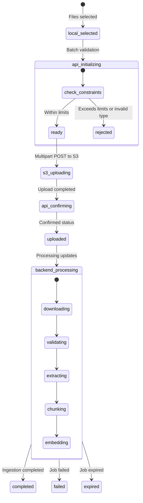

# Frontend Architecture Specification & Implementation Plan

This document details the high-level software architecture, design guidelines, and system layouts for the production-grade Next.js frontend of the **Document Intelligence Platform**.

---

## 1. Architectural Blueprint & Directory Layout

To ensure modularity, separation of concerns, and clean testing boundaries, the frontend is built using Next.js App Router (Client-Side Rendering prioritized for real-time dashboards), utilizing **Tailwind CSS** for layout styling, and structured as follows:

```
apps/frontend/
├── public/
│   └── fonts/             # Modern typography assets (e.g., Outfit, Inter)
├── src/
│   ├── app/
│   │   ├── layout.tsx         # Global layouts, Theme Provider, Toast/Notification Provider
│   │   ├── page.tsx           # Home Dashboard (Document inventory, Upload card, Progress feed)
│   │   └── globals.css        # Core Tailwind directives + design token definitions
│   ├── components/
│   │   ├── ui/                # Accessible glassmorphic UI kit (Button, Card, Progress, Toast)
│   │   ├── layout/            # Sidebar, Header, User session status indicators
│   │   ├── upload/            # UploadZone (drag-and-drop), FileQueue, UploadErrorMessage
│   │   └── documents/         # DocumentList, ProgressIndicator, IngestionTrackerCard
│   ├── config/
│   │   └── api-routing.ts     # Hybrid API toggles (choose 'api' vs 'mock' per endpoint)
│   ├── hooks/
│   │   ├── useAuth.ts         # Session registration, slide validation, and error interceptor
│   │   ├── useUpload.ts       # Managed file upload queue, S3 multipart presigned POST uploader
│   │   └── useIngestion.ts    # SSE connection wrapper with automatic polling fallback
│   ├── lib/
│   │   ├── api-client.ts      # Gateway client route mapping requests to actual API or MSW Mock
│   │   ├── s3-uploader.ts     # Multi-part Form-Data S3 client (presigned POST compatible)
│   │   └── sse-client.ts      # EventSource listener with reconnection & timeout handlers
│   ├── mocks/
│   │   ├── browser.ts         # MSW browser worker initialization setup
│   │   └── handlers.ts        # Mock service worker API handlers simulating backend states
│   ├── types/
│   │   ├── api.d.ts           # Type mappings matching apps/api spec (DocumentStatusObject, etc.)
│   │   └── index.ts
│   └── store/
│       └── useAppStore.ts     # Zustand global store managing active session, documents status
├── tailwind.config.ts         # Tailwind CSS framework token declarations
├── package.json
├── tsconfig.json
└── next.config.js
```

### High-Level Hybrid API Architecture

The application uses an API Gateway proxy wrapper (`api-client.ts`). Based on rules defined in [api-routing.ts](file:///Users/parth/RAG/Document%20Intelligence%20Platform/apps/frontend/src/config/api-routing.ts), calls are routed either to the actual backend API or intercepted by local Mock Service Worker (MSW) handlers:



---

## 2. Ingestion Progress & Upload State Machine

The frontend maintains and maps document ingestion states. Backend state updates map directly to corresponding visual indicators as specified below:



---

## 3. High-Level Phasing Directory

The implementation roadmap is broken into 5 parallel delivery phases. Detailed task specifications, requirements, validation criteria, and target files for each phase reside under the project's task tracker:

1. **Phase 1: Foundation, Tailwind & Hybrid Mocking**
   - *Scope*: Workspace scaffolding, Tailwind utility design system tokens, and local Mock Service Worker (MSW) handlers intercepting API pipelines.
   - *Task File*: [phase-1-setup.md](file:///Users/parth/RAG/Document%20Intelligence%20Platform/tasks/frontend/phase-1-setup.md)
2. **Phase 2: Application Shell, Session & API Layer**
   - *Scope*: Global navigation layout shell, session auth initialization hook, API client error converters, and dashboard landing panels.
   - *Task File*: [phase-2-shell.md](file:///Users/parth/RAG/Document%20Intelligence%20Platform/tasks/frontend/phase-2-shell.md)
3. **Phase 3: Batch Upload & S3 Ingestion Flow**
   - *Scope*: Drag-and-drop validation picker, batch upload hook manager, concurrent upload throttling, and direct presigned S3 POST submissions.
   - *Task File*: [phase-3-upload.md](file:///Users/parth/RAG/Document%20Intelligence%20Platform/tasks/frontend/phase-3-upload.md)
4. **Phase 4: Real-Time Processing & Progress Visualizer**
   - *Scope*: EventSource handler wrappers syncing chunk progress via SSE, fallback polling loops, and extraction tracking cards.
   - *Task File*: [phase-4-progress.md](file:///Users/parth/RAG/Document%20Intelligence%20Platform/tasks/frontend/phase-4-progress.md)
5. **Phase 5: Query Interface & Streaming Q&A**
   - *Scope*: Chat history window, streaming fetch reader hook, regex bracket-to-badge citation component parser, and citation card popovers.
   - *Task File*: [phase-5-chat.md](file:///Users/parth/RAG/Document%20Intelligence%20Platform/tasks/frontend/phase-5-chat.md)

---

## 4. Cross-Cutting Design Specifications

### Zustand Store State Layout

| Namespace | Key | Type | Description |
|---|---|---|---|
| `session` | `activeSession` | `SessionObject \| null` | Stores truncated UUID, start timestamps, and token expiry. |
| `documents` | `documentRegistry` | `Record<string, DocumentStatusObject>` | Dictionary holding backend-reported document statuses. |
| `uploads` | `localProgressQueue` | `Record<string, LocalProgressState>` | In-memory percentages for files currently writing to S3. |
| `ui` | `sidebarCollapsed` | `boolean` | Sidebar state modifier. |
| `ui` | `themeMode` | `'light' \| 'dark' \| 'system'` | Theme styling controller. |

---

## 5. Risks, Assumptions, and Mitigation Strategy

### Risks
1. **HTTP/1.1 Connection Limits (Local Development)**:
   - *Risk*: Standard local servers without HTTP/2 active restrict browsers to 6 parallel connections per domain. Multiple open tabs with active SSE progress listeners (`GET /api/documents/progress`) will quickly exhaust socket pools, causing page freezes.
   - *Mitigation*: Restrict SSE listeners strictly to active ingestion sessions. Share tab states or automatically downscale idle tabs to polling with an aggressive backoff timer (e.g., polling every 10 seconds if tab is hidden).
2. **S3 Presigned POST Order Enforcements**:
   - *Risk*: The AWS S3 API enforces that form fields sent in a presigned POST payload must appear *before* the file payload. Incorrect key-value insertion order in `FormData` results in immediate `AccessDenied` errors.
   - *Mitigation*: Implement standard validation tests verifying that `s3-uploader.ts` appends each key from `uploadFields` in exact structural order, placing the raw file (`file`) as the final parameter.
3. **CORS / Cookie Policy Blockages**:
   - *Risk*: If the frontend and backend are hosted on separate domains, browser cookie rules (e.g. Third-Party Cookie Deprecation) might drop the `session_token` cookie.
   - *Mitigation*: Configure environment-driven CORS handlers on the Express API (CORS middleware with `Access-Control-Allow-Credentials: true` and dynamic origin mirroring in development, restricted to `CORS_ALLOWED_ORIGIN` in production). Additionally, client-side rewrites or reverse proxies (like Next.js proxy rules) can be configured to maintain single-origin behaviors where necessary.


### Assumptions
* **Single Session Tenancy**: Users only need access to documents uploaded in their current session. Expiry of the session token drops database access rights automatically.
* **Persistent Cookie Storage**: The backend manages cookie verification and sliding windows. The frontend relies strictly on native browser cookie preservation; no localStorage tokens are required.
* **Modern CSS Platform**: The target client supports CSS Custom Properties, flexbox/grid layout engines, and hardware-accelerated `backdrop-filter` styles.
