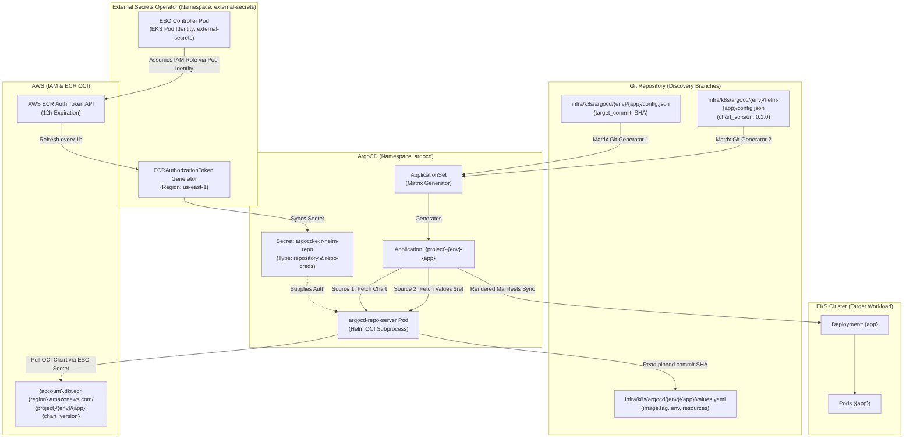
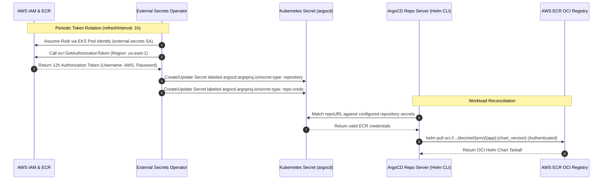
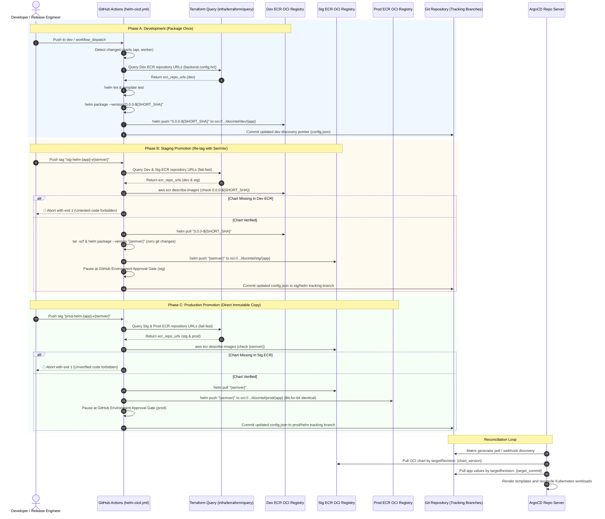

# Helm GitOps Multi-Source OCI & ApplicationSet Architecture Specification

This specification document details the infrastructural and manifest design implemented in Task 505 for decoupled GitOps releases of Helm chart templates and application workloads using ArgoCD Multiple Sources and AWS ECR OCI registries.

---

## 1. Architectural Motivation & Principles

Previously, ArgoCD tracked Helm charts directly from Git paths, coupling Kubernetes manifests and application Docker image releases into a single deployment unit. This created several operational friction points:

1. **Coupled Release Cycles**: Updating Helm templates required triggering application workflows or vice-versa.
2. **Tag Mutation & Non-Standard Packaging**: Standard Helm tooling expects OCI registries (`helm push oci://...`) where the chart name matches the repository leaf.
3. **Immutability Vulnerability**: Direct branch tracking risks unreviewed manifest drift.

### Core Design Principles

- **Decoupled Lifecycle via ArgoCD Multiple Sources (`$ref`)**: Source 1 pulls versioned Helm charts from AWS ECR as an OCI registry (`targetRevision: '{{chart_version}}'`). Source 2 pulls values files from the Git repository pinned to immutable commit SHAs (`ref: app_values`, `targetRevision: '{{target_commit}}'`).
- **Hierarchical ECR Repository Naming**: ECR repositories are named `${project_name}/${environment}/${app}` (e.g. `docintel/dev/api`). This matches the `name: api` declared in `Chart.yaml`, allowing native `helm push` without mutating chart metadata.
- **Automated ECR Token Generation via External Secrets Operator**: Rather than relying on unreliable in-container credential helpers, the **External Secrets Operator (ESO)** leverages EKS Pod Identity to assume an IAM role, invoke `ecr:GetAuthorizationToken`, and dynamically sync 12-hour valid credentials into ArgoCD repository secrets (`argocd.argoproj.io/secret-type: repository` and `repo-creds`) every 1 hour.
- **Matrix Generator Git Discovery**: An ArgoCD `ApplicationSet` uses dual-generator matrix joins to independently resolve `{app}` releases from `{env}/app` tracking paths and chart versions from `{env}/helm` tracking paths.

---

## 2. Component Topology & Reconciliation Flow



---

## 3. Directory Layout & Concern Separation

The GitOps configuration directory under `infra/k8s/argocd/` is structured into isolated concerns across each environment:

```text
infra/k8s/argocd/
├── dev/
│   ├── api/
│   │   ├── config.json         # { "app": "api", "target_commit": "dev" }
│   │   └── values.yaml         # Image repository override, replicas, KEDA scaling
│   ├── worker/
│   │   ├── config.json         # { "app": "worker", "target_commit": "dev" }
│   │   └── values.yaml         # Worker-specific configurations
│   ├── helm-api/
│   │   └── config.json         # { "app": "api", "chart_name": "api", "chart_version": "0.1.0" }
│   └── helm-worker/
│       └── config.json         # { "app": "worker", "chart_name": "worker", "chart_version": "0.1.0" }
├── stg/
│   ├── api/ ...
│   ├── worker/ ...
│   ├── helm-api/ ...
│   └── helm-worker/ ...
└── prod/
    ├── api/ ...
    ├── worker/ ...
    ├── helm-api/ ...
    └── helm-worker/ ...
```

---

## 4. ArgoCD ApplicationSet Matrix Specification

The `ApplicationSet` resource located at `infra/terraform/k8s/manifests/argocd-applicationset.yaml` executes a cross-generator matrix join for each microservice:

```yaml
apiVersion: argoproj.io/v1alpha1
kind: ApplicationSet
metadata:
  name: "${project_name}-${environment}-argocd-applicationset"
  namespace: argocd
spec:
  generators:
    - matrix:
        generators:
          - git:
              repoURL: "${github_repository_url}"
              revision: "${targetRevision_app}"
              files:
                - path: "infra/k8s/argocd/${environment}/api/config.json"
          - git:
              repoURL: "${github_repository_url}"
              revision: "${targetRevision_helm}"
              files:
                - path: "infra/k8s/argocd/${environment}/helm-api/config.json"
    - matrix:
        generators:
          - git:
              repoURL: "${github_repository_url}"
              revision: "${targetRevision_app}"
              files:
                - path: "infra/k8s/argocd/${environment}/worker/config.json"
          - git:
              repoURL: "${github_repository_url}"
              revision: "${targetRevision_helm}"
              files:
                - path: "infra/k8s/argocd/${environment}/helm-worker/config.json"

  template:
    metadata:
      name: "${project_name}-${environment}-{{app}}"
    spec:
      project: default
      sources:
        # Source 1: Helm Chart from ECR OCI Registry
        - repoURL: "${ecr_registry_url}/${project_name}/${environment}"
          chart: "{{chart_name}}"
          targetRevision: "{{chart_version}}"
          helm:
            valueFiles:
              - values.yaml
              - $app_values/infra/k8s/argocd/${environment}/{{app}}/values.yaml

        # Source 2: Application Values & Image Tags from Git
        - repoURL: "${github_repository_url}"
          targetRevision: "{{target_commit}}"
          ref: app_values

      destination:
        server: "https://kubernetes.default.svc"
        namespace: default
```

---

## 5. Security & Authentication Architecture (External Secrets Operator)

### 5.1 Why In-Container Credential Helpers Fail
When ArgoCD reconciles Helm OCI charts, `argocd-repo-server` executes the external `helm` CLI binary as a separate subprocess (e.g. `helm pull oci://...`). The external Helm CLI cannot natively resolve IAM credentials from EKS Pod Identity without static or injected repository secrets. Additionally, repo-server's built-in `reposerver.ecr.credential.helper=true` parameter relies on legacy internal handlers that fail in decoupled multi-source OCI environments.

### 5.2 External Secrets Operator (ESO) Architecture
To guarantee reliable, zero-touch authentication, **External Secrets Operator** automates the lifecycle of short-lived AWS ECR authorization tokens:



1. **IAM Policy & Role** (`external_secrets_policy` & `external_secrets_role`):
   - Defined in `infra/terraform/aws/modules/eks/iam.tf`.
   - Grants `ecr:GetAuthorizationToken` on `*`.
   - Trust relationship bound to `pods.eks.amazonaws.com` service principal (`sts:AssumeRole`, `sts:TagSession`).
2. **EKS Pod Identity Association**:
   - Binds `external_secrets_role` to ServiceAccount `external-secrets` in namespace `external-secrets`.
   - The ESO controller automatically retrieves AWS credentials via standard AWS SDK environment chains.
3. **`ECRAuthorizationToken` Generator**:
   - Defined in `infra/terraform/k8s/manifests/argocd-ecr-secret.yaml` (`kind: ECRAuthorizationToken`, namespace `argocd`).
   - Retrieves fresh AWS ECR credentials scoped to the active cluster region.
4. **Dual ArgoCD Secret Templating (`ExternalSecret`)**:
   - **Repository Secret (`argocd-ecr-helm-repo`)**: Labeled `argocd.argoproj.io/secret-type: repository`, with `url: "${ecr_registry_url}/${project_name}/${environment}"`, `enableOCI: "true"`, and `type: "helm"`. Provides exact-match repository registration in ArgoCD.
   - **Repository Credential Template (`argocd-ecr-repo-creds`)**: Labeled `argocd.argoproj.io/secret-type: repo-creds`, with `url: "${ecr_registry_url}"`. Serves as prefix fallback credentials for all ECR repositories under the registry domain.
   - Refreshes automatically every 1 hour (`refreshInterval: 1h`), far ahead of the 12-hour AWS ECR token expiration window.

---

## 6. CI/CD Pipeline Implementation (`helm-cicd.yml`)

The automated lifecycle of Helm charts is driven by `.github/workflows/helm-cicd.yml`, establishing a strict **"Package once in dev, promote identical immutable artifacts to stg/prod"** operational model.

### 6.1 End-to-End Promotion Architecture Flow



### 6.2 Key Pipeline Mechanics

1. **Trigger Modalities**:
   - **Push to `dev`** (`paths: ['infra/k8s/helm/**']`): Runs `git diff` against `HEAD~1` to dynamically detect changed charts and constructs matrix `["api"]`, `["worker"]`, or `["api", "worker"]`.
   - **Manual `workflow_dispatch`**: Exclusively available for `dev` testing; accepts chart target input (`all`, `api`, or `worker`).
   - **Release Tags**: Pushing tags matching `{env}-helm-{app}-v{semver}` (e.g. `stg-helm-api-v1.0.0` or `prod-helm-worker-v1.2.0`) isolates the release to a single targeted app matrix.

2. **Zero In-Tree Mutation (`Chart.yaml` Immutability)**:
   - `Chart.yaml` files committed in git remain untouched at all times.
   - Dynamic version compilation in `dev` uses `helm package --version "0.0.0-${SHORT_SHA}"`.
   - Staging promotion unpacks the spre-tested archive (`tar -xzf`) in ephemeral memory and repacks with `--version "{semver}"`.
   - Production promotion performs a direct `helm pull` and `helm push` of the exact `{semver}` archive with zero rebuilding.

3. **Dynamic Infrastructure Query & Fail-Fast State Validation**:
   - ECR repository URLs are never hardcoded or manually constructed.
   - The pipeline invokes `infra/terraform/query` against `infra/terraform/aws/environments/${env}/backend.config.hcl` to retrieve actual outputs from remote Terraform state (`ecr_repo_urls`).
   - If remote state is inaccessible or a repo URL is not present, the pipeline immediately exits with code 1, enforcing that infrastructure must be deployed prior to deploying application charts.

4. **Serialized Downstream GitOps Commits (`gitops-commit`)**:
   - Chart packaging and promotion run in parallel across the matrix.
   - Metadata artifacts (`chart-metadata-${app}`) are passed to a single downstream serialized job.
   - Employs concurrency groups:
     - `git-commit-dev` for `dev` (shared with Docker build pipelines).
     - `git-commit-${env}-helm` for higher environments.
   - Updates `infra/k8s/argocd/${env}/helm-${app}/config.json` pointers:
     ```json
     {
       "app": "${app}",
       "chart_name": "${app}",
       "chart_version": "${chart_version}"
     }
     ```
   - Executes atomic git commit and pushes to tracking branches (`dev` or `{env}/helm`) with automatic pull-rebase loops to prevent push conflicts.
