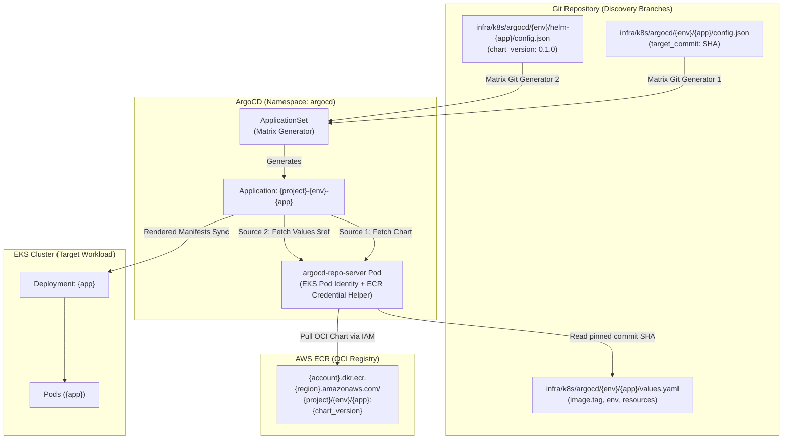

# Helm GitOps Multi-Source OCI & ApplicationSet Architecture Specification

This specification document details the infrastructural and manifest design implemented in Task 505 for decoupled GitOps releases of Helm chart templates and application workloads using ArgoCD Multiple Sources and AWS ECR OCI registries.

---

## 1. Architectural Motivation & Principles

Previously, ArgoCD tracked Helm charts directly from Git paths, coupling Kubernetes manifests and application Docker image releases into a single deployment unit. This created several operational friction points:
1. **Coupled Release Cycles**: Updating Helm templates required triggering application workflows or vice-versa.
2. **Tag Mutation & Non-Standard Packaging**: Standard Helm tooling expects OCI registries (`helm push oci://...`) where the chart name matches the repository leaf.
3. **Immutability Vulnerability**: Direct branch tracking risks unreviewed manifest drift.

### Core Design Principles
* **Decoupled Lifecycle via ArgoCD Multiple Sources (`$ref`)**: Source 1 pulls versioned Helm charts from AWS ECR as an OCI registry (`targetRevision: '{{chart_version}}'`). Source 2 pulls values files from the Git repository pinned to immutable commit SHAs (`ref: app_values`, `targetRevision: '{{target_commit}}'`).
* **Hierarchical ECR Repository Naming**: ECR repositories are named `${project_name}/${environment}/${app}` (e.g. `docintel/dev/api`). This matches the `name: api` declared in `Chart.yaml`, allowing native `helm push` without mutating chart metadata.
* **IAM Authentication via EKS Pod Identity**: ArgoCD `argocd-repo-server` authenticates dynamically with AWS ECR using an EKS Pod Identity association and ArgoCD's native ECR credential helper, avoiding 12-hour credential expiry issues.
* **Matrix Generator Git Discovery**: An ArgoCD `ApplicationSet` uses dual-generator matrix joins to independently resolve `{app}` releases from `{env}/app` tracking paths and chart versions from `{env}/helm` tracking paths.

---

## 2. Component Topology & Reconciliation Flow



---

## 3. Directory Layout & Concern Separation

The GitOps configuration directory under `infra/k8s/argocd/` is structured into isolated concerns across each environment:

```text
infra/k8s/argocd/
├── dev/
│   ├── api/
│   │   ├── config.json         # { "app": "api", "target_commit": "dev" }
│   │   └── values.yaml         # Image repository override, replicas, KEDA scaling
│   ├── worker/
│   │   ├── config.json         # { "app": "worker", "target_commit": "dev" }
│   │   └── values.yaml         # Worker-specific configurations
│   ├── helm-api/
│   │   └── config.json         # { "app": "api", "chart_name": "api", "chart_version": "0.1.0" }
│   └── helm-worker/
│       └── config.json         # { "app": "worker", "chart_name": "worker", "chart_version": "0.1.0" }
├── stg/
│   ├── api/ ...
│   ├── worker/ ...
│   ├── helm-api/ ...
│   └── helm-worker/ ...
└── prod/
    ├── api/ ...
    ├── worker/ ...
    ├── helm-api/ ...
    └── helm-worker/ ...
```

---

## 4. ArgoCD ApplicationSet Matrix Specification

The `ApplicationSet` resource located at `infra/terraform/k8s/manifests/argocd-applicationset.yaml` executes a cross-generator matrix join for each microservice:

```yaml
apiVersion: argoproj.io/v1alpha1
kind: ApplicationSet
metadata:
  name: "${project_name}-${environment}-argocd-applicationset"
  namespace: argocd
spec:
  generators:
    - matrix:
        generators:
          - git:
              repoURL: '${github_repository_url}'
              revision: '${targetRevision_app}'
              files:
                - path: "infra/k8s/argocd/${environment}/api/config.json"
          - git:
              repoURL: '${github_repository_url}'
              revision: '${targetRevision_helm}'
              files:
                - path: "infra/k8s/argocd/${environment}/helm-api/config.json"
    - matrix:
        generators:
          - git:
              repoURL: '${github_repository_url}'
              revision: '${targetRevision_app}'
              files:
                - path: "infra/k8s/argocd/${environment}/worker/config.json"
          - git:
              repoURL: '${github_repository_url}'
              revision: '${targetRevision_helm}'
              files:
                - path: "infra/k8s/argocd/${environment}/helm-worker/config.json"

  template:
    metadata:
      name: '${project_name}-${environment}-{{app}}'
    spec:
      project: default
      sources:
        # Source 1: Helm Chart from ECR OCI Registry
        - repoURL: '${ecr_registry_url}/${project_name}/${environment}'
          chart: '{{chart_name}}'
          targetRevision: '{{chart_version}}'
          helm:
            valueFiles:
              - values.yaml
              - $app_values/infra/k8s/argocd/${environment}/{{app}}/values.yaml

        # Source 2: Application Values & Image Tags from Git
        - repoURL: '${github_repository_url}'
          targetRevision: '{{target_commit}}'
          ref: app_values

      destination:
        server: 'https://kubernetes.default.svc'
        namespace: default
```

---

## 5. Security & Authentication Architecture

### EKS Pod Identity for ArgoCD Repo Server
Instead of static AWS IAM Access Keys or legacy IRSA mutating webhooks, authentication uses **EKS Pod Identity Association**:

1. **IAM Policy** (`argocd_repo_server_ecr_policy`):
   * `ecr:GetAuthorizationToken` on `*` (standard AWS requirement for ECR token retrieval).
   * `ecr:BatchCheckLayerAvailability`, `ecr:GetDownloadUrlForLayer`, `ecr:BatchGetImage` scoped exclusively to the project's ECR repository ARNs.
2. **Trust Relationship**: Trust policy authorizes the `pods.eks.amazonaws.com` service principal with `sts:AssumeRole` and `sts:TagSession`.
3. **EKS Pod Identity Association**: Associates IAM role `argocd_repo_server_role` to ServiceAccount `argocd-repo-server` in namespace `argocd`.
4. **Credential Helper**: ArgoCD Helm release in `infra/terraform/k8s/helm.tf` enables `configs.params.reposerver\.ecr\.credential\.helper = "true"`. The repo-server natively uses the AWS SDK to retrieve short-lived authorization tokens on demand.
