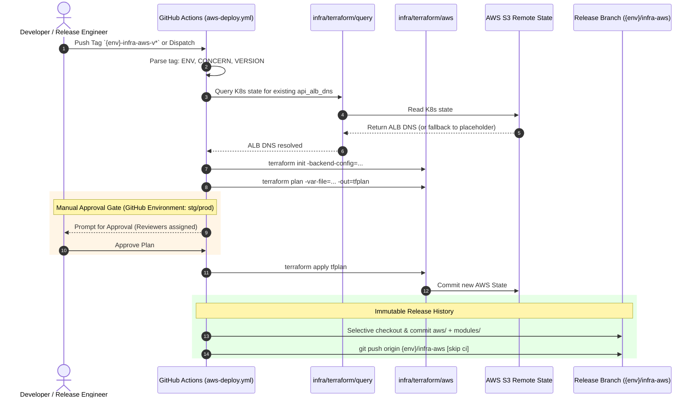
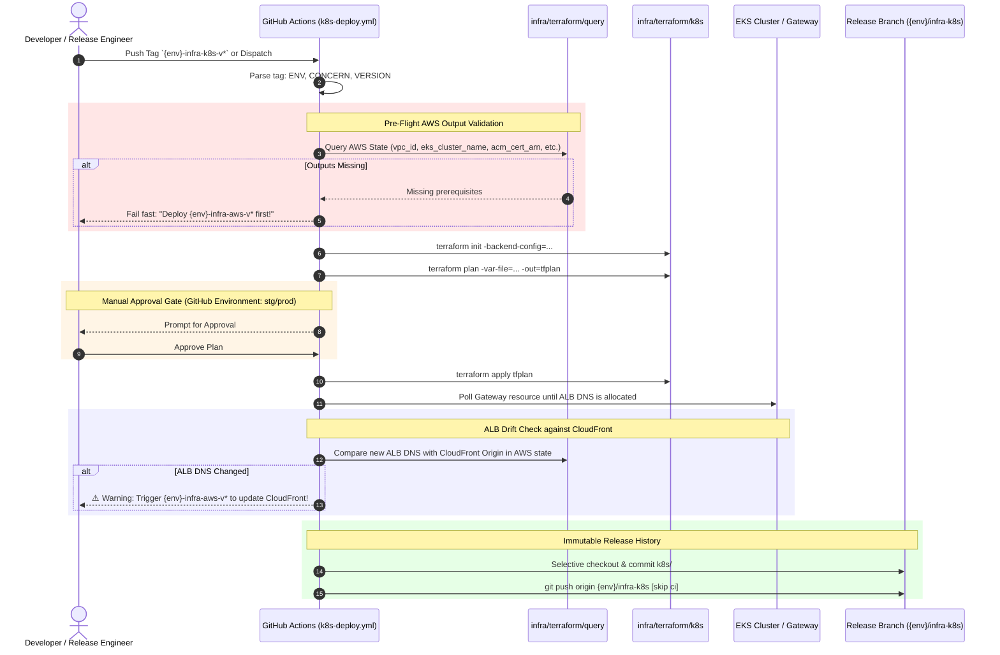

# Multi-Environment Infrastructure CI/CD Specification

This document details the multi-environment, multi-concern CI/CD pipeline architecture for the AI Document Intelligence Platform, covering AWS and Kubernetes infrastructure across `dev`, `stg`, and `prod` environments.

---

## 1. Core Architectural Strategy

### 1.1 Separation of Environments and Concerns
To support independent release lifecycles and limit blast radius, the deployment model isolates:
* **Environments**: `dev` (development / trunk), `stg` (staging), `prod` (production).
* **Concerns**:
  * Infrastructure: `infra-aws`, `infra-k8s`
  * Microservices: `api`, `worker`, `frontend`
  * Helm Workloads: `helm-api`, `helm-worker`

### 1.2 Tag-Driven Releases with Immutable Audit Branches
* **Active Development**: All feature work and continuous integration merge into the trunk branch (`dev`). Commits directly trigger dev-scoped workflows.
* **Staging and Production Releases**: Triggered exclusively by cutting semantic release tags from validated commits on `dev`:
  * AWS Infrastructure: `{env}-infra-aws-v{major}.{minor}.{patch}` (e.g. `stg-infra-aws-v1.0.0`, `prod-infra-aws-v1.0.0`)
  * K8s Infrastructure: `{env}-infra-k8s-v{major}.{minor}.{patch}` (e.g. `stg-infra-k8s-v1.0.0`, `prod-infra-k8s-v1.0.0`)
  * Applications: `{env}-{api|worker|frontend}-v{major}.{minor}.{patch}`
  * Helm Charts: `{env}-helm-{api|worker}-v{major}.{minor}.{patch}`
* **Release Tracking Branches**:
  * Branches named `{env}/infra-aws`, `{env}/infra-k8s`, `{env}/{api|worker|frontend}` are **never manually modified or merged via pull requests**.
  * The CI/CD pipeline automatically executes a **selective checkout and commit** upon a verified, successful `apply`, capturing only the deployed files for that concern.
  * This preserves an immutable, chronological git history of what is running in each environment without pollutive merge noise.

---

## 2. Refactored Terraform Architecture

### 2.1 Directory Layout
The infrastructure layout adheres to a DRY root-module topology with isolated environment parameter files:

```text
infra/terraform/
├── aws/
│   ├── main.tf                    # Root AWS module instantiation (calls ./modules/core)
│   ├── variables.tf               # Top-level variables
│   ├── outputs.tf                 # Exported AWS outputs (VPC, EKS, RDS, S3, SSM, ACM)
│   ├── backend.tf                 # Generic S3 backend declaration
│   ├── modules/                   # Environment-agnostic modules (core, vpc, eks, storage, etc.)
│   └── environments/
│       ├── dev/
│       │   ├── backend.config.hcl # dev S3 bucket, key, and region
│       │   └── dev.tfvars         # dev-specific parameter overrides
│       ├── stg/
│       │   ├── backend.config.hcl # stg S3 bucket, key, and region
│       │   └── stg.tfvars         # stg-specific parameter overrides
│       └── prod/
│           ├── backend.config.hcl # prod S3 bucket, key, and region
│           └── prod.tfvars        # prod-specific parameter overrides
├── k8s/
│   ├── main.tf                    # Root K8s/Helm provider configurations
│   ├── helm.tf                    # Helm releases (ALB Controller, ArgoCD, KEDA)
│   ├── k8s.tf                     # Gateway API CRDs, ALB GatewayClass, Secrets Store CSI
│   ├── variables.tf
│   ├── outputs.tf                 # Exported K8s outputs (api_alb_dns)
│   ├── backend.tf                 # Generic S3 backend declaration
│   ├── manifests/                 # Kubernetes manifest templates
│   └── environments/
│       ├── dev/
│       │   ├── backend.config.hcl # dev S3 backend config for K8s state
│       │   └── dev.tfvars         # dev-specific K8s variables
│       ├── stg/
│       │   ├── backend.config.hcl # stg S3 backend config for K8s state
│       │   └── stg.tfvars         # stg-specific K8s variables
│       └── prod/
│           ├── backend.config.hcl # prod S3 backend config for K8s state
│           └── prod.tfvars        # prod-specific K8s variables
└── query/
    ├── main.tf                    # data.terraform_remote_state reader (zero external providers)
    └── variables.tf               # bucket, key, region variables
```

### 2.2 Dual-Compatible Backend Configuration (`backend.config.hcl`)
Each environment defines its S3 state parameters in HCL syntax:
```hcl
bucket = "tf-state-doc-intel-dev-793140949744-us-east-1-an"
key    = "aws/terraform.tfstate"
region = "us-east-1"
```
Because HCL key-value format is dual-compatible:
1. It is passed as `-backend-config=environments/{env}/backend.config.hcl` during `terraform init`.
2. It is passed as `-var-file="../aws/environments/{env}/backend.config.hcl"` to `infra/terraform/query/` to read state directly.

### 2.3 Lightweight State Query Engine (`infra/terraform/query`)
* Declares only `data "terraform_remote_state" "infra"` backed by `s3`.
* Requires **zero external third-party providers** (`provider["terraform.io/builtin/terraform"]`).
* `terraform init` executes in < 1s with 0 MB download overhead.
* Produces an ephemeral local `.tfstate` on the GitHub Actions runner which is safely discarded at job completion.
* **Security Guardrail**: `.gitignore` must enforce `*.tfstate*` and `.terraform/` to prevent accidental workstation commits.

---

## 3. AWS Infrastructure Pipeline Flow (`aws-deploy.yml`)



### Key Operational Rules:
1. **CloudFront ↔ Dynamic ALB Handshake**:
   - Queries `infra/terraform/query` against the K8s backend config for the target environment.
   - If K8s has already deployed the Gateway, its ALB DNS is passed to `TF_VAR_api_alb_dns_name`.
   - If K8s has not yet been deployed (e.g. greenfield environment), a placeholder DNS is supplied so CloudFront provisions without blocking.
2. **Two-Stage Execution (Plan -> Gate -> Apply)**:
   - `plan`: Generates execution plan and uploads artifact `tfplan`.
   - `apply`: Binds to `environment: ${{ env.ENV }}`. In `stg` and `prod`, GitHub Environment protection rules require manual approval before proceeding.
3. **Selective Audit Commit**:
   - Updates the target `{env}/infra-aws` tracking branch with only `infra/terraform/aws/**` and `infra/terraform/modules/**` from the release tag.

---

## 4. K8s Infrastructure Pipeline Flow (`k8s-deploy.yml`)



### Key Operational Rules:
1. **Pre-flight AWS Output Validation**:
   - Uses `infra/terraform/query` with `backend.config.hcl` from AWS to assert that `vpc_id`, `eks_cluster_name`, `acm_cert_arn`, `ssm_parameters_name`, and `ssm_secrets_name` exist in the remote state.
   - If any are missing, the workflow aborts with an actionable error.
2. **Blast-Radius Isolation (No Direct AWS Applies)**:
   - K8s workflow **never** performs targeted `terraform apply` on AWS storage or CloudFront modules.
   - If the dynamically generated ALB DNS changed from what CloudFront is currently targeting, K8s alerts the user to cut an AWS release tag to update the origin.
3. **Selective Audit Commit**:
   - Updates `{env}/infra-k8s` with `infra/terraform/k8s/**` snapshots.

---

## 5. Branch & Tag Trigger Summary Matrix

| Pipeline | Trigger Pattern | Concurrency Group | Environment Gate | Selective Tracking Branch |
| :--- | :--- | :--- | :--- | :--- |
| **AWS Infra (dev)** | Push to `dev` under `infra/terraform/aws/**` | `deploy-aws-dev` | None (Automatic) | N/A (Trunk tracked) |
| **AWS Infra (stg)** | Push tag: `stg-infra-aws-v*` | `deploy-aws-stg` | `stg` (Reviewer required) | `stg/infra-aws` |
| **AWS Infra (prod)** | Push tag: `prod-infra-aws-v*` | `deploy-aws-prod` | `prod` (Reviewer required) | `prod/infra-aws` |
| **K8s Infra (dev)** | Push to `dev` under `infra/terraform/k8s/**` | `deploy-k8s-dev` | None (Automatic) | N/A (Trunk tracked) |
| **K8s Infra (stg)** | Push tag: `stg-infra-k8s-v*` | `deploy-k8s-stg` | `stg` (Reviewer required) | `stg/infra-k8s` |
| **K8s Infra (prod)** | Push tag: `prod-infra-k8s-v*` | `deploy-k8s-prod` | `prod` (Reviewer required) | `prod/infra-k8s` |
