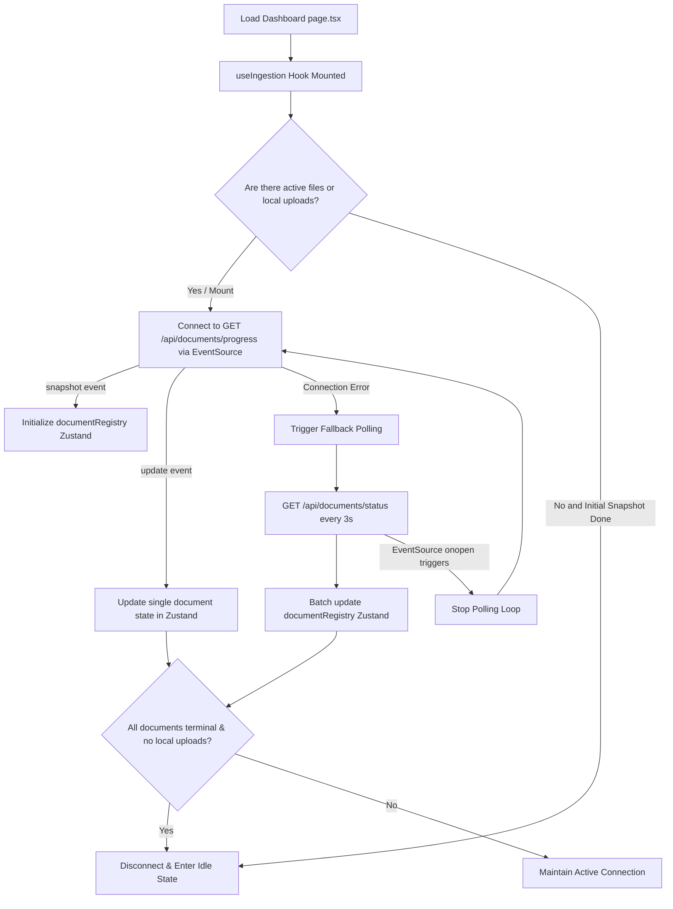

# Real-Time Progress Ingestion Specification

This document details the architectural design, failover mechanisms, and lifecycle control policies implemented in Task F4.1.

---

## 1. Architectural Design

To monitor document ingestion stages in real-time, the client establishes a Server-Sent Events (SSE) connection using the browser-native `EventSource` API. If the connection fails or drops, it switches to a background polling loop, recovering the SSE connection automatically when the network restores.

---

## 2. Named Event Routing

The client connects to `GET /api/documents/progress` with credentials enabled to match the current signed session. It registers event listeners for two named event channels:

1. **`snapshot` Channel**:
   - Sent by the backend immediately upon client connection.
   - Emits a JSON array of all existing documents associated with the session.
   - The hook initializes `documentRegistry` with this array.

2. **`update` Channel**:
   - Sent by the backend trigger whenever a database record changes (using PostgreSQL `LISTEN/NOTIFY` progress channels).
   - Emits a single JSON object containing the updated fields of a processing document.
   - The hook updates the specific record in the Zustand store by ID, ensuring visual updates are synchronized within milliseconds.

---

## 3. Fallback Polling Loop

To maintain robustness against unstable networks, firewalls blocking long-lived HTTP streams, or server restarts, a failover mechanism is built-in:

- **Trigger**: An `onerror` event on the EventSource object indicates connection loss.
- **Action**: The hook switches to polling mode, querying `GET /api/documents/status` every 3 seconds to fetch the complete batch status.
- **Recovery**: The browser native `EventSource` automatically retries connection in the background. When it successfully connects, the `onopen` listener triggers, immediately terminating the polling loop to conserve server resources and network bandwidth.

---

## 4. Lifecycle Controls (HTTP/1.1 Socket Preservation)

Browsers restrict parallel connections to the same host (typically capped at 6 concurrent connections under HTTP/1.1). If multiple tabs keep long-lived SSE connections open, the socket pool is easily exhausted, causing page blocks.

To prevent this connection starvation:
- **Tear-Down**: The `useIngestion` hook monitors active background processes and local upload queues. Once all documents in the registry are in terminal states (`completed`, `failed`, `expired`) and no local uploads are active, the effect runs its cleanup: closing the `EventSource` connection and terminating any active polling loops.
- **Wake-Up**: If the user drops new files, `localProgressQueue` transitions to having active items, resetting `shouldConnect` to `true`. The hook instantly establishes a new `EventSource` connection to capture subsequent updates.
