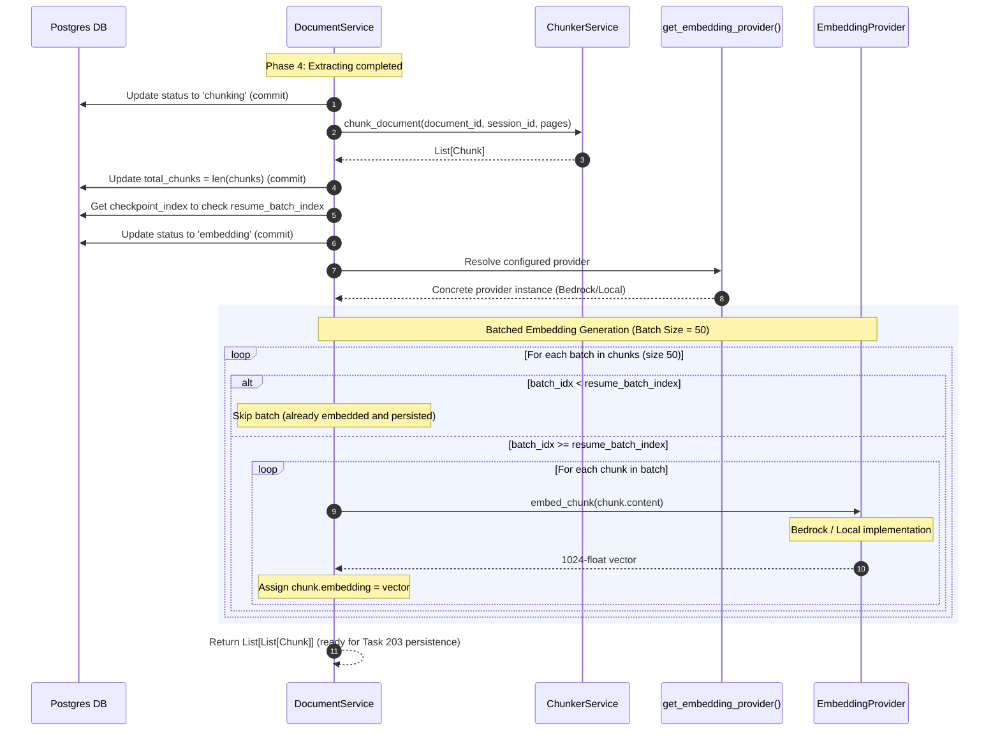

# Task 202: Worker Chunking & Embedding Specification

This document details the design, algorithm, retry policy, configuration options, and verification records for Task 202 (Worker Chunking & Embedding).

## 1. Overview

The Chunking & Embedding stage takes extracted page-by-page text, segments it into overlapping paragraph-based chunks, and generates 1024-dimension vector embeddings. It supports both Amazon Bedrock Titan Embeddings V2 and a local Sentence-Transformers fallback model (`intfloat/e5-large-v2`) to achieve local development parity.

---

## 2. Ingestion Pipeline Stage Flow

The chunking and embedding phases are executed sequentially as part of the overall document processing pipeline. The pipeline resolves the concrete provider using the factory function `get_embedding_provider()`:



---

## 3. Paragraph-Based Sliding Window Chunking

The chunker splits the text of each page individually to keep page boundaries aligned.

### Parameters
* **Target size:** ~500 tokens (approximated via whitespace split count)
* **Overlap:** 75 tokens
* **Split boundaries:** Splits on paragraph breaks (`\n\n`), falling back to sentence boundaries (`re.split` on punctuation spacing) if a paragraph exceeds 500 tokens.

### Chunker Sliding Window Algorithm
1. **Paragraph Extraction**: Page text is split into paragraphs.
2. **Size Enforcement**: If a paragraph is larger than 500 tokens, it is split into sentences. If any sentence still exceeds 500 tokens, it is split by word limits. This guarantees that all text units are strictly `<= 500` tokens.
3. **Window Aggregation**: Units are aggregated into a chunk until adding another unit exceeds the target size of 500 tokens (or at least 1 unit is included).
4. **Overlap Calculation**: The starting point of the next chunk is shifted backward by finding the suffix of the current window whose token count is `<= 75` tokens (ensuring progress of at least 1 unit is made to prevent infinite loops).
5. **Sequential Global Indexing**: Chunks are numbered globally sequentially starting at `0` across the entire document.

---

## 4. Vector Embedding Generation

### Decoupled Provider Architecture
To prevent tight coupling between core worker orchestration logic and specific vector model client SDKs, generating vector embeddings is decoupled behind the `EmbeddingProvider` interface:

* **`EmbeddingProvider(ABC)`**: The abstract base class that defines the contract: `embed_chunk(self, text: str) -> List[float]`.
* **`BedrockEmbeddingProvider`**: The Amazon Bedrock Titan Embeddings V2 client implementation, utilizing exponential backoff retry parameters and boto3 clients.
* **`LocalEmbeddingProvider`**: The local `sentence-transformers` client implementation, utilizing the `intfloat/e5-large-v2` model and E5-specific query/passage prefix styling.
* **`get_embedding_provider()`**: Factory function checking the `settings.EMBEDDING_PROVIDER` configuration to return the active concrete provider instance.

### Boto3 Bedrock Runtime Client
- Connects to the AWS Bedrock service using the model ID `amazon.titan-embed-text-v2:0`.
- Configured to produce normalized 1024-dimension vectors:
  ```json
  {
      "inputText": "<chunk text>",
      "dimensions": 1024,
      "normalize": true
  }
  ```

### Exponential Backoff Retry Policy
Transient errors (e.g. `ThrottlingException`, `ServiceUnavailableException`) are retried automatically:
- **Maximum attempts:** 3
- **Initial delay:** 1.0 second
- **Backoff multiplier:** 2.0x (retries at 1s, then 2s)
Permanent errors (e.g. `ValidationException`, `ModelNotReadyException`, `AccessDeniedException`) bypass retries and propagate immediately.

### Local Testing Override
When `EMBEDDING_PROVIDER=local` is configured in settings:
- Instantiates a local `SentenceTransformer` using model `intfloat/e5-large-v2` (yielding 1024-dimension floats).
- Formats input passages using E5's required prefix structure: `"passage: <chunk text>"`.
- Completely avoids any boto3 AWS network calls.


---

## 5. Verification Records

1. **Chunker Unit Tests** ([test_chunker.py](file:///Users/parth/RAG/Document%20Intelligence%20Platform/apps/worker/tests/test_chunker.py)):
   - Verified that basic paragraph splitting groups small paragraphs correctly.
   - Verified sentence boundaries fallback when a paragraph exceeds target size.
   - Verified multi-page document pagination and global sequential chunk index numbering.
2. **Embeddings Unit Tests** ([test_embeddings.py](file:///Users/parth/RAG/Document%20Intelligence%20Platform/apps/worker/tests/test_embeddings.py)):
   - Verified that Bedrock API calls are routed correctly, producing 1024-dimension float vectors.
   - Simulated `ThrottlingException` on the first call, asserting it retries and succeeds on the second attempt.
   - Verified permanent errors propagate immediately without retrying.
   - Verified local provider (`EMBEDDING_PROVIDER=local`) loads Sentence-Transformers and returns correct vectors.
3. **Integration Test Suite** ([test_integration.py](file:///Users/parth/RAG/Document%20Intelligence%20Platform/apps/worker/tests/test_integration.py)):
   - Executed the entire pipeline end-to-end against local LocalStack and pgvector instances, ensuring both chunker and embeddings phases complete successfully.
