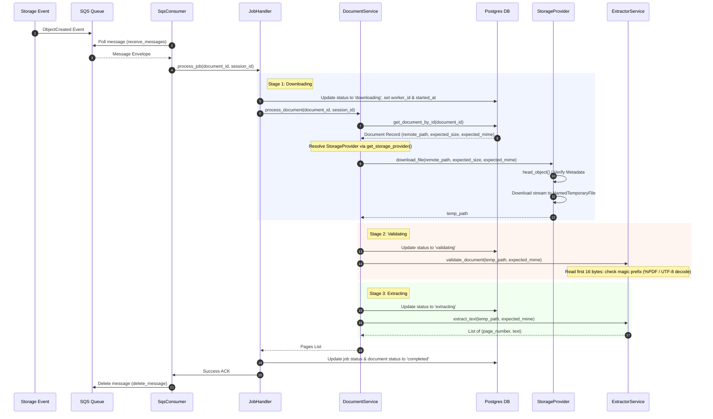

# Task 201: Worker Document Extraction Specification

This document details the architectural layout, implementation specifics, security design, and verification records for Task 201 (Worker Document Extraction).

## 1. Overview

The Document Extraction pipeline coordinates downloading raw user files from S3, conducting server-side validation of file integrity and metadata, performing magic number binary validation to assert the file types, and executing page-by-page text parsing using PyMuPDF (for PDFs) or UTF-8 decode scans (for plain text).

## 2. Ingestion Pipeline Stages & Architecture

The worker processes raw file ingestion sequentially through three distinct processing stages:

---

## 3. Detailed Stage Designs

### Stage 1: Downloading

1. **Status Update**: Transitions `processing_jobs.status` to `downloading` and sets `worker_id` to the Pod Hostname (`os.environ.get("HOSTNAME")`) or a randomized UUID fallback, along with `started_at` to `now()`.
2. **Storage Provider Resolution**: The `DocumentService` calls `get_storage_provider()` to dynamically resolve the active `StorageProvider` implementation (e.g. `S3StorageProvider`).
3. **Pre-download Object Verification**: The storage provider queries object metadata (using `head_object` for S3) to verify:
   - **Existence**: If object not found, status is transitioned to `failed`, `error_code` set to `file_not_found`, and SQS message is deleted.
   - **Size**: If remote object size does not match the database expected size, status transitions to `failed`, `error_code` set to `size_mismatch`, and SQS message is deleted.
   - **Content Type**: If remote Content-Type does not match the database expected MIME type, status transitions to `failed`, `error_code` set to `content_type_mismatch`, and SQS message is deleted.
4. **Local Stream Download**: Storage provider downloads the remote file to a local `tempfile.NamedTemporaryFile(delete=False)` and returns the local path to the caller.

### Stage 2: Validating

1. **Status Update**: Transitions `processing_jobs.status` to `validating`.
2. **Magic Number Inspection**:
   - Reads the first 16 bytes of the local temp file.
   - Checks for valid header bytes matching the declared MIME type:
     - `application/pdf`: Asserts that the header starts with `%PDF` (hex `25 50 44 46`).
     - `text/plain`: Bypasses magic byte checks and executes a UTF-8 decode check on the first 1024 bytes.
   - If magic bytes mismatch or decoding fails, transitions the job and document to `failed` with `error_code = 'invalid_file_type'`, and deletes the SQS message.

### Stage 3: Extracting

1. **Status Update**: Transitions `processing_jobs.status` to `extracting`.
2. **PyMuPDF Text Parsing**:
   - PDF files are opened via `fitz.open(temp_path)`.
   - Iterates through the document pages, calls `page.get_text("text")`, strips whitespace, and discards empty pages.
   - Returns a list of `(page_number, text)` tuples.
   - If the PDF is corrupt, password-protected, or fails parsing, PyMuPDF throws an exception. The worker catches this, transitions statuses to `failed` with `error_code = 'extraction_failed'`, and deletes the SQS message.
3. **Plain Text Parsing**:
   - Reads the entire UTF-8 text file and returns a single page tuple `[(1, text_content)]`.
4. **Temporary File Cleanup**: An absolute `finally` block in the worker pipeline ensures `os.remove(temp_path)` is executed to clean up local disk space under both success and failure execution paths.

---

## 4. Security & Performance Impact Analysis

### Security Hardening

- **Anti-Spoofing Verification**: The worker does not trust the `Content-Type` header supplied by the client during upload presigning. Performing binary magic number inspection prevents malicious uploads (e.g. uploading an executable renamed as `.pdf`) from executing parsing workflows.
- **S3 Data Amplification Defense**: Performing a `head_object` metadata inspection _before_ beginning the file download protects the worker from downloading oversized files that exceed the declared DB size, avoiding resource starvation and disk overflow attacks.
- **Cascading Session Security**: Since sessions, documents, and processing jobs have Cascading Delete constraints, if a user's session expires or is deleted, database triggers and cascades drop the associated records. If the worker polls an expired job, the database lookup fails gracefully, throwing a `PermanentFailure` to clean the SQS message.

### Performance Optimization

- **Stream-Based Downloading**: Stream-based chunk writes to disk avoid loading large documents into memory all at once.
- **Aggressive Cleanup**: Local temporary files are aggressively deleted within the request-response lifecycle inside a `finally` block, ensuring no stale file handles or leaked files consume disk space.
- **No Database Polling**: State transitions trigger `PG NOTIFY` commands that update progress streams immediately.

### Architectural Decoupling (StorageProvider Interface)
- **Dependency Inversion Principle**: The core orchestration layers (`SqsConsumer`, `JobHandler`, `DocumentService`) no longer accept or process S3-specific parameters (e.g. S3 keys, S3 buckets). Instead, they operate on abstract `document_id` and `session_id` parameters, loading details from the DB and passing remote file path parameters into the abstract `StorageProvider` interface.
- **Factory Pattern**: The factory `get_storage_provider()` resolves the concrete `StorageProvider` implementation (currently `S3StorageProvider`) from configurations at runtime, allowing seamless future migrations (e.g., to Google Cloud Storage or Azure Blob Storage) with zero changes to job handler or extraction pipelines.

---

## 5. Verification Records

The extraction pipeline is verified via a 7-case integration suite ([test_integration.py](file:///Users/parth/RAG/Document%20Intelligence%20Platform/apps/worker/tests/test_integration.py)) running against a local PostgreSQL database and LocalStack S3/SQS:

1. **Step 1, 2, 3, 9 (PDF Success)**: Verified S3 uploads trigger SQS messages, which are consumed by the worker, transition through `downloading -> validating -> extracting -> completed`, extract native text, and delete the temp file.
2. **Step 3 (Plain Text Success)**: Verified plain text file processing returns page 1 correctly.
3. **Step 4 (File Not Found)**: Verified missing S3 objects trigger `file_not_found` error codes, transition jobs to `failed`, and delete the SQS message.
4. **Step 5 (Size Mismatch)**: Verified files with mismatched sizes trigger `size_mismatch` and transition to `failed`.
5. **Step 6 (Content-Type Mismatch)**: Verified S3 Content-Type headers that do not match the database trigger `content_type_mismatch` and fail.
6. **Step 7 (Magic Byte Validation)**: Verified spoofed file uploads (JPEG renamed as PDF) are caught by `%PDF` magic bytes checks and fail with `invalid_file_type`.
7. **Step 8 (Corrupt / Password-Protected PDF)**: Verified corrupt PDF parsing fails inside PyMuPDF and transitions status to `failed` with `error_code = 'extraction_failed'`.
