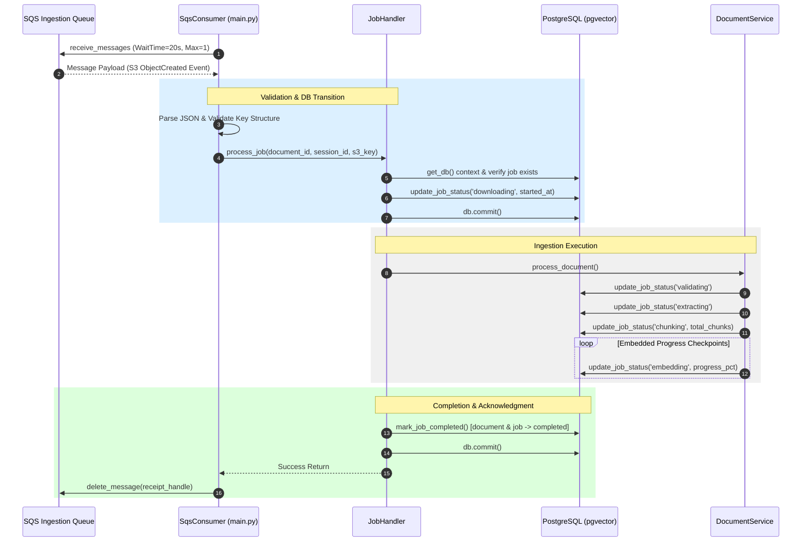

# Worker SQS Consumer & Decoupled Architecture Spec

This document details the modular architecture, message ingestion contract, error-routing rules, dead-letter-queue (DLQ) bridge, and graceful shutdown handling implemented for the background Python worker daemon.

---

## 1. Overview & Objectives

The retrieval-augmented generation (RAG) background worker is a decoupled Python daemon running in `/apps/worker/`. Its main objectives are:
* **Decoupled Architecture**: Follow a highly modular layer-based pattern to scale processing independently from the front-facing API.
* **SQS Polling Loop**: Poll AWS SQS (or local LocalStack SQS) using long-polling (`WaitTimeSeconds=20`) to consume S3 ObjectCreated event notifications.
* **Resiliency & Error Routing**: Distinguish between transient and permanent errors, deleting messages immediately on permanent failures, and letting them expire in visibility timeout for retry on transient ones.
* **Dead Letter Queue (DLQ) Bridge**: Run a secondary polling loop in a background thread to update database status for messages routed to the DLQ.
* **Graceful Shutdown**: Handle termination signals (`SIGTERM`, `SIGINT`) gracefully, completing processing of the active task before exiting.

---

## 2. Modular Architecture Breakdown

Aligned with the **Python Background Worker Development Skill**, the worker code is separated into layers:

```
apps/worker/
├── app/
│   ├── clients/         # External service SDK wrappers (e.g., SqsClient)
│   ├── config/          # Configurations, environment reading with python-dotenv
│   ├── consumers/       # Message deserialization, validation, queue delete triggers
│   ├── handlers/        # Workflow orchestrators, transactions, and error routing
│   ├── models/          # Declarative SQLAlchemy models (Document, ProcessingJob)
│   ├── repositories/    # Database queries, updates, state transitions
│   ├── services/        # Business logic: extraction, chunking, embedding
│   └── utils/           # Helper utilities (structured logging, JSON formatters)
├── tests/               # Unit and integration test suite
├── main.py              # Application bootstrap, signals registration, thread orchestrator
└── requirements.txt     # Pip dependencies
```

### Components Roles
* **`app.config.settings`**: Uses `python-dotenv` to load `.env` from the project root in local/test environments and provides strongly typed config properties.
* **`app.clients.sqs_client`**: Abstracted `boto3` wrapper for connecting to SQS queues, checking queue accessibility, fetching, and deleting messages.
* **`app.models.db`**: Creates the database engine and provides a context manager `get_db()` to yield transactional database sessions that automatically commit on success and rollback on exceptions.
* **`app.repositories.job_repository`**: Performs all database updates. Uses SQLAlchemy query operations to transition states of `documents` and `processing_jobs` tables atomically.
* **`app.services.document_service`**: Coordinates document extraction, chunking, and embedding. Transitions status checkpoints in the DB to reflect granular progress.
* **`app.handlers.job_handler`**: Orchestrates database transactions, maps unhandled service exceptions to `TransientFailure` or `PermanentFailure` exceptions, and triggers DLQ failure updates.
* **`app.consumers.sqs_consumer`**: Continuous polling loop. Performs JSON deserialization, validates S3 object key conventions, and calls the `JobHandler` to execute the task.

---

## 3. Message Processing & Transaction Flow

The processing lifecycle follows a rigorous state machine from S3 event reception to terminal state resolution. 

### Sequence Diagram



---

## 4. Error Classification & DLQ Routing

### Error Category Handling
1. **Successful Execution**: The pipeline completes -> `JobRepository.mark_job_completed` is called -> SqsConsumer calls `sqs.delete_message` to delete the message.
2. **Permanent Failures** (e.g. corrupt PDF format, invalid S3 key configuration, missing database job references):
   * `PermanentFailure` is thrown or caught.
   * `JobRepository.mark_job_failed` transitions document and job status to `'failed'` in the DB.
   * SqsConsumer deletes the message from SQS to avoid consuming queue processing time.
3. **Transient Failures** (e.g. database timeout, network connectivity hiccups):
   * An unhandled exception is re-thrown as a `TransientFailure`.
   * SqsConsumer catches it and does **not** call `delete_message`.
   * SQS visibility timeout (600 seconds) expires, and SQS re-delivers the message for retry (up to 3 times).

### Dead Letter Queue (DLQ) Bridge Poller
* Messages that fail 3 times are automatically moved by SQS to the DLQ.
* Since the worker isn't active on those messages, their status would remain stuck in `'downloading'` or `'processing'` on the UI.
* The **DLQ Poller** runs in a secondary background thread, querying the DLQ every 30 seconds.
* For every message found in the DLQ, it parses the payload, resolves `document_id`, transitions its status in the DB to `'failed'` with error code `'max_retries_exceeded'`, and deletes the message from the DLQ.

---

## 5. Graceful Shutdown Signal Handling

To prevent jobs from being terminated midway and leaving SQS or DB states corrupted:
1. Signal handlers are registered for `SIGINT` (Ctrl+C) and `SIGTERM` (Kubernetes pod eviction).
2. Upon interception, the handler sets a global `shutdown_requested = True` flag.
3. The main poller loop checks this flag at the start of each iteration. If `True`, the poller terminates the polling cycle.
4. The current running job is allowed to complete processing (success or failure) and transition DB/SQS accordingly before the process exits.
5. SQS messages that are in the middle of being fetched when a shutdown occurs will automatically expire and be processed by another container.

---

## 6. Database Model Automation & Static Code Generation

To align the Python worker ORM definitions with the TypeScript Prisma schema (the single source of truth for the database migrations), we automate models generation using `sqlacodegen`.

### Automated Generation Pipeline
1. **Automation Script (`apps/worker/scripts/generate_models.py`)**: A programmatic generator that connects to the database specified in `apps/worker/.env` and triggers `sqlacodegen` using the declarative generator.
2. **Post-Processing Injection**: Because pgvector vectors (`vector(1024)`) and PostgreSQL network types (`INET`) are custom, `sqlacodegen` maps them to `NullType` and sets annotations to `Any` (generating `Mapped[Optional[Any]]`). Since SQLAlchemy 2.0 throws type errors for `Any`, the script post-processes `app/models/generated_models.py` to register a `type_annotation_map` on the declarative `Base` class:
   ```python
   class Base(DeclarativeBase):
       type_annotation_map = {
           Any: NullType
       }
   ```
3. **Plural-to-Singular Aliasing (`app/models/__init__.py`)**: Standard SQL conventions map tables as plural (`documents`, `processing_jobs`), but codebases represent entities in the singular (`Document`, `ProcessingJob`). The models initialization maps these via aliases:
   ```python
   from app.models.generated_models import Documents as Document, ProcessingJobs as ProcessingJob
   ```
   This decoupling ensures zero modifications are required in repository or service business logic when models are regenerated.
