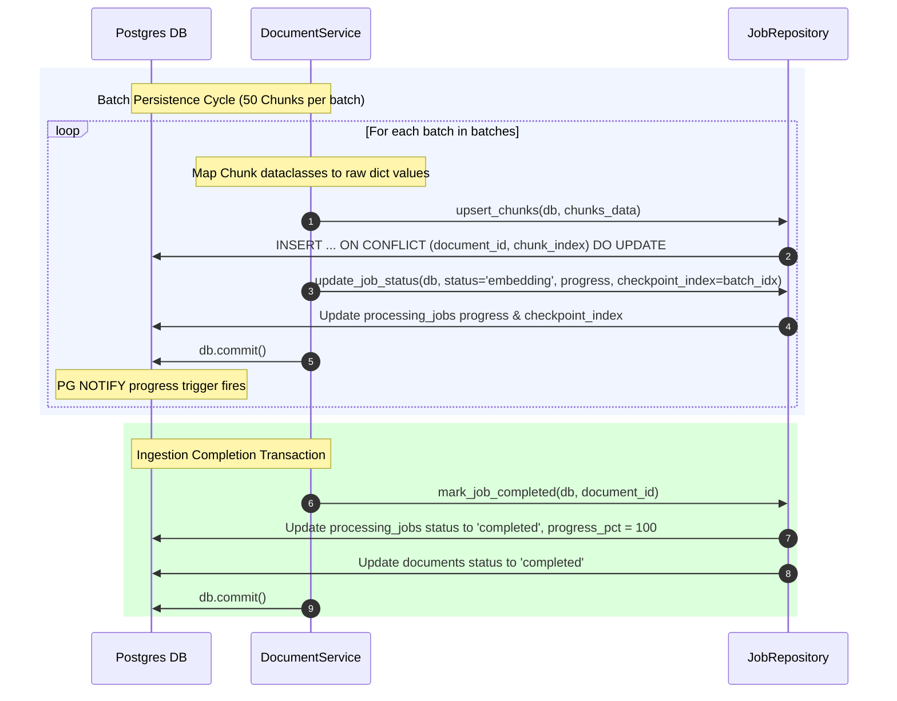

# Task 203: Worker Vector Storage & progress updates Specification

This document details the design, idempotent upsert strategy, checkpoint-based resume mechanism, progress formulas, and verification records for Task 203 (Worker Vector Storage & progress updates).

## 1. Overview

The Vector Storage stage idempotently persists extracted chunk texts and vector embeddings to the PostgreSQL database using SQLAlchemy. It manages transactional checkpointing, progress updates, and final completion state transitions across the `ProcessingJobs` and `Documents` tables.

---

## 2. Ingestion Pipeline Persistence Flow

The transactional batch persistence, checkpoint updates, and final completion are executed inside the document service:



---

## 3. Detailed Design

### Idempotent Chunk Upsert
To support seamless retries and avoid duplicate records, chunk upsert utilizes PostgreSQL `ON CONFLICT` constraints. If a chunk with the same `(document_id, chunk_index)` already exists, its columns are updated with the new incoming batch attributes:
```sql
INSERT INTO document_chunks (document_id, chunk_index, content, token_count, embedding, model_version, updated_at)
VALUES (...)
ON CONFLICT (document_id, chunk_index) 
DO UPDATE SET
    embedding = EXCLUDED.embedding,
    content = EXCLUDED.content,
    token_count = EXCLUDED.token_count,
    model_version = EXCLUDED.model_version,
    updated_at = NOW();
```

### Checkpoint-Based Resume
Upon initializing processing, the service queries the database for `checkpoint_index` on the active job record. The pipeline calculates the `resume_batch_index = checkpoint_index + 1`. All batch indices `< resume_batch_index` are skipped during embeddings generation and DB upsert, preventing duplicate processing if a worker evicts or crashes.

### Per-Batch Progress Updates
After each batch is written to the DB, the service computes:
- `processed = (batch_idx + 1) * 50`
- `progress = int((processed / total_chunks) * 100)`
It updates:
- `processed_chunks = min(processed, total_chunks)`
- `progress_pct = min(progress, 99)` (keeping the progress capped at 99% until final completion to prevent pre-mature 100% display)
- `checkpoint_index = batch_idx`

### Final Completion Transaction
When all batches are processed successfully, `mark_job_completed()` is called inside a single transaction boundary:
- Sets `processing_jobs.status = 'completed'`
- Sets `processing_jobs.progress_pct = 100`
- Sets `processing_jobs.processed_chunks = total_chunks`
- Sets `processing_jobs.checkpoint_index = total_batches - 1`
- Sets `documents.status = 'completed'`
- Sets `completed_at = now()`

---

## 4. Verification Records

1. **Integration Test Suite** ([test_integration.py](file:///Users/parth/RAG/Document%20Intelligence%20Platform/apps/worker/tests/test_integration.py)):
   - Updated integration test assertions to query the `document_chunks` table and verify the correct chunk index, page numbers, text content, model version, and 1024-dimension float embedding vectors are fully persisted.
   - Asserted that `documents` and `processing_jobs` transition to the `'completed'` status.
   - Re-ran the test suite, passing all 44 unit and integration tests successfully.
