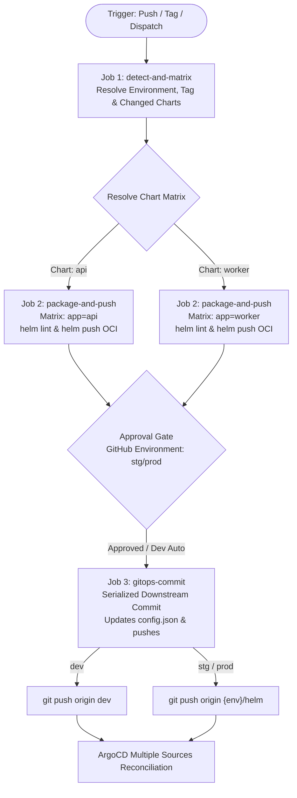

# Task 506: Multi-Environment Helm Chart CI/CD Pipeline (`helm-cicd.yml`)

## 1. Goal

Implement an enterprise-grade, multi-environment, tag-driven CI/CD deployment pipeline for Helm charts in `.github/workflows/helm-cicd.yml`. The pipeline automates packaging, linting, and pushing Helm chart templates to **Amazon ECR as OCI registries**, supports concurrent matrix builds for multiple microservice charts (`api` and `worker`), enforces strict immutability without modifying files on disk via dynamic `--version` compilation, and synchronizes releases with ArgoCD through serialized GitOps discovery tracking commits to `{env}/helm` branches.

---

## 2. Prerequisites & Architecture References

* **Infrastructure Prerequisites (Task 505)**:
  * ECR repositories configured with slash namespaces (`${project_name}/${environment}/${app}`) in `infra/terraform/aws/modules/ecr/main.tf`.
  * EKS IAM Role and Pod Identity Association for `argocd-repo-server` with ECR pull permissions.
  * ArgoCD Helm release configured with `configs.params.reposerver\.ecr\.credential\.helper = "true"`.
  * Multi-Source Matrix `ApplicationSet` in `infra/terraform/k8s/manifests/argocd-applicationset.yaml` resolving OCI charts from ECR and values files from Git.
  * Directory layout established under `infra/k8s/argocd/${environment}/helm-${app}/config.json`.
* **Architecture Specifications**:
  * [Multi-Environment Infrastructure CI/CD Specification](file:///Users/parth/RAG/Document%20Intelligence%20Platform/docs/context/infrastructure-cicd-spec.md)
  * [Helm GitOps Multi-Source OCI & ApplicationSet Architecture Specification](file:///Users/parth/RAG/Document%20Intelligence%20Platform/docs/context/helm-gitops-multi-source-spec.md)

---

## 3. Workflow Trigger Configuration

The workflow `.github/workflows/helm-cicd.yml` must support three trigger modalities:

```yaml
name: Helm Chart CI/CD Pipeline

on:
  push:
    branches:
      - dev
    paths:
      - 'infra/k8s/helm/**'
    tags:
      - 'stg-helm-api-v*'
      - 'stg-helm-worker-v*'
      - 'prod-helm-api-v*'
      - 'prod-helm-worker-v*'
  workflow_dispatch:
    inputs:
      app:
        description: 'Select chart to package and deploy (dev only)'
        required: true
        type: choice
        options:
          - 'all'
          - 'api'
          - 'worker'
        default: 'all'
```

> **Note on Tag Triggers**: GitHub Actions evaluates tag push filters independently from `paths:`. Tags must reside at the top level of `on.push` rather than nested under `paths:`.

---

## 4. Pipeline Architecture & Execution Flow

The workflow is structured into three decoupled phases to maintain clean separation of concerns, enable parallel matrix compilation, and eliminate git push race conditions:



---

## 5. Detailed Job Specifications

### 5.1 Job 1: `detect-and-matrix` (Environment, Version & Target Resolution)

* **Runs On**: `ubuntu-latest`
* **Outputs**:
  * `env`: Target deployment environment (`dev`, `stg`, `prod`).
  * `matrix`: JSON array of charts to package (e.g. `["api"]`, `["worker"]`, or `["api", "worker"]`).
  * `version`: Chart semantic version (e.g. `0.0.0-${SHORT_SHA}` for `dev`, or extracted semver like `1.2.0` for `stg`/`prod`).
  * `short_sha`: Git commit short SHA (`git rev-parse --short HEAD`).
  * `commit_sha`: Full 40-character commit SHA (`${{ github.sha }}`).

#### Operational Logic:
1. **Tag Trigger Detection**:
   * If `github.ref_type == 'tag'`:
     * Matches format `{env}-helm-{app}-v{major}.{minor}.{patch}`.
     * Extracts `ENV` (`stg` or `prod`).
     * Extracts `APP` (`api` or `worker`).
     * Extracts `VERSION` (stripping `{env}-helm-{app}-v` prefix).
     * Sets `matrix=["${APP}"]`.
2. **Push / Dispatch (Dev) Detection**:
   * If `github.event_name == 'push'` or `'workflow_dispatch'`:
     * Sets `ENV="dev"`.
     * Computes `VERSION="0.0.0-${SHORT_SHA}"`.
     * **Dynamic Path Inspection**:
       * If `workflow_dispatch` and `inputs.app != 'all'`: sets `matrix=["${inputs.app}"]`.
       * Otherwise, inspects changed files using `git diff HEAD~1 HEAD --name-only` or path filters:
         * If `infra/k8s/helm/api/**` changed $\rightarrow$ include `"api"`.
         * If `infra/k8s/helm/worker/**` changed $\rightarrow$ include `"worker"`.
         * If neither or both changed (or `inputs.app == 'all'`) $\rightarrow$ sets `matrix=["api", "worker"]`.

---

### 5.2 Job 2: `package-and-push` (Parallel OCI Compilation Matrix)

* **Needs**: `detect-and-matrix`
* **Runs On**: `ubuntu-latest`
* **Strategy**:
  ```yaml
  strategy:
    matrix:
      app: ${{ fromJson(needs.detect-and-matrix.outputs.matrix) }}
    fail-fast: true
  ```

#### Step-by-Step Execution:
1. **Checkout Code**:
   * Uses `actions/checkout@3d3c42e5aac5ba805825da76410c181273ba90b1` (v7.0.1) with `fetch-depth: 0`.
2. **Setup Tools**:
   * Installs Helm v3 (minimum 3.8+ for stable OCI registry commands).
3. **AWS OIDC Authentication**:
   * Assumes CI IAM Role via `aws-actions/configure-aws-credentials` using `vars.TF_VAR_GITHUB_ACTIONS_CI_ROLE` and `vars.AWS_REGION`.
4. **Resolve ECR Registry Domain**:
   * Queries remote infrastructure output via `infra/terraform/query` against `infra/terraform/aws/environments/${{ env }}/backend.config.hcl` to retrieve `ecr_registry_url` (or defaults to `${AWS_ACCOUNT_ID}.dkr.ecr.${AWS_REGION}.amazonaws.com`).
5. **Helm Registry Login**:
   * Authenticates Helm directly against private AWS ECR:
     ```bash
     aws ecr get-login-password --region ${{ env.AWS_REGION }} | \
       helm registry login --username AWS --password-stdin "${{ steps.ecr.outputs.registry_domain }}"
     ```
6. **Linting & Template Validation**:
   * Runs strict linting and dry-run template rendering against environment values:
     ```bash
     helm lint "infra/k8s/helm/${{ matrix.app }}"
     helm template "test-release" "infra/k8s/helm/${{ matrix.app }}" \
       -f "infra/k8s/helm/${{ matrix.app }}/values.yaml" \
       -f "infra/k8s/helm/${{ matrix.app }}/values.${{ needs.detect-and-matrix.outputs.env }}.yaml" > /dev/null
     ```
7. **Dynamic OCI Packaging (`--version`)**:
   * **Crucial Principle**: Does not touch `Chart.yaml` on disk. Uses `--version` to dynamically set the tarball metadata:
     ```bash
     TARGET_VERSION="${{ needs.detect-and-matrix.outputs.version }}"
     helm package "infra/k8s/helm/${{ matrix.app }}" --version "${TARGET_VERSION}" --destination /tmp/charts
     ```
8. **Push Chart to ECR OCI Repository**:
   * Pushes the compiled archive to the slash-delimited ECR repository path:
     ```bash
     TARGET_REPO="oci://${{ steps.ecr.outputs.registry_domain }}/${{ vars.TF_PROJECT_NAME }}/${{ needs.detect-and-matrix.outputs.env }}"
     helm push "/tmp/charts/${{ matrix.app }}-${TARGET_VERSION}.tgz" "${TARGET_REPO}"
     ```
9. **Record Artifact Metadata**:
   * Emits a step output recording `{ "app": "${{ matrix.app }}", "version": "${TARGET_VERSION}" }` and uploads a minimal metadata artifact for the downstream commit job.

---

### 5.3 Job 3: `gitops-commit` (Serialized Multi-App Tracking Commit)

* **Needs**: `[detect-and-matrix, package-and-push]`
* **Runs On**: `ubuntu-latest`
* **Environment Gate**: Binds to `environment: ${{ needs.detect-and-matrix.outputs.env }}` to enforce reviewer approval for `stg` and `prod`.
* **Concurrency Lock**:
  * For `dev`: `concurrency: git-commit-dev` (shared with Docker CI/CD workflows committing to `dev`).
  * For `stg` / `prod`: `concurrency: git-commit-${{ needs.detect-and-matrix.outputs.env }}-helm`.

#### Step-by-Step Execution:
1. **Checkout Target Branch**:
   * For `dev`: Checks out `dev` branch.
   * For `stg` / `prod`: Checks out `{env}/helm` release tracking branch (creating orphan branch if not yet existing).
2. **Download Artifact Metadata**:
   * Collects all packaged app versions from Job 2.
3. **Update Discovery Configurations**:
   * For each packaged app in the matrix (`api`, `worker`, or both):
     * Updates `infra/k8s/argocd/${{ env }}/helm-${app}/config.json`:
       ```json
       {
         "app": "${app}",
         "chart_name": "${app}",
         "chart_version": "${version}"
       }
       ```
4. **Selective Commit & Push with Rebase Loop**:
   * Configures git bot committer:
     ```bash
     git config --global user.name "github-actions[bot]"
     git config --global user.email "github-actions[bot]@users.noreply.github.com"
     ```
   * Stages only Helm configuration files:
     ```bash
     for app in "${APPS[@]}"; do
       git add "infra/k8s/argocd/${{ env }}/helm-${app}/config.json"
     done
     ```
   * Commits and pushes with rebase loop:
     ```bash
     git commit -m "release(helm): update charts [${APPS[*]}] to ${{ needs.detect-and-matrix.outputs.version }} [skip ci]" \
                -m "Environment: ${{ needs.detect-and-matrix.outputs.env }}" \
                -m "Workflow Run: ${{ github.server_url }}/${{ github.repository }}/actions/runs/${{ github.run_id }}" \
         || echo "No changes to commit"

     git pull --rebase origin "${TARGET_BRANCH}"
     git push origin HEAD:"${TARGET_BRANCH}"
     ```

---

## 6. Local Testing & Verification Strategy (`act`)

To verify the workflow locally without cloud deployment billing, provide local simulation fixtures under `.github/workflows/helm-cicd/`:

1. **Mock Event Fixtures**:
   * `events/push-dev.json`: Simulates push to `dev` touching `infra/k8s/helm/api/templates/deployment.yaml`.
   * `events/dev-all.json`: Simulates manual `workflow_dispatch` selecting `all`.
   * `events/tag-stg-api.json`: Simulates pushing tag `stg-helm-api-v1.0.0`.
   * `events/tag-prod-worker.json`: Simulates pushing tag `prod-helm-worker-v1.0.0`.
2. **Local Taskfile (`.github/workflows/helm-cicd/Taskfile.yaml`)**:
   * `task lint`: Runs `helm lint` across `api` and `worker` charts.
   * `task template-dev`: Dry-run renders manifests for `dev`.
   * `task test-push-dev`: Executes `act` simulation using `events/push-dev.json`.
   * `task test-tag-stg`: Executes `act` simulation using `events/tag-stg-api.json`.

---

## 7. Acceptance Criteria & Definition of Done

- [ ] **Workflow File Created**: `.github/workflows/helm-cicd.yml` conforms to GitHub Actions syntax with all pinned action commit SHAs.
- [ ] **Dynamic Versioning Tested**: `helm package` executes with `--version` flag without dirtying working directory `Chart.yaml` files.
- [ ] **Parallel Matrix Execution**: Dev runs touching both charts correctly run `package-and-push` for both `api` and `worker` concurrently.
- [ ] **Atomic GitOps Commits**: A single consolidated `gitops-commit` step updates both `config.json` files when both charts are built, preventing git push non-fast-forward conflicts.
- [ ] **Approval Gates Active**: Staging and production releases pause at the GitHub Environment gate before committing to `{env}/helm`.
- [ ] **ArgoCD Discovery Compatibility**: The emitted `config.json` schema strictly matches the keys expected by `infra/terraform/k8s/manifests/argocd-applicationset.yaml` (`chart_name`, `chart_version`, `app`).
- [ ] **Documentation Updated**: Update `docs/progress/implementation-status.md` and `docs/context/current-state.md` to reflect Task 506.
