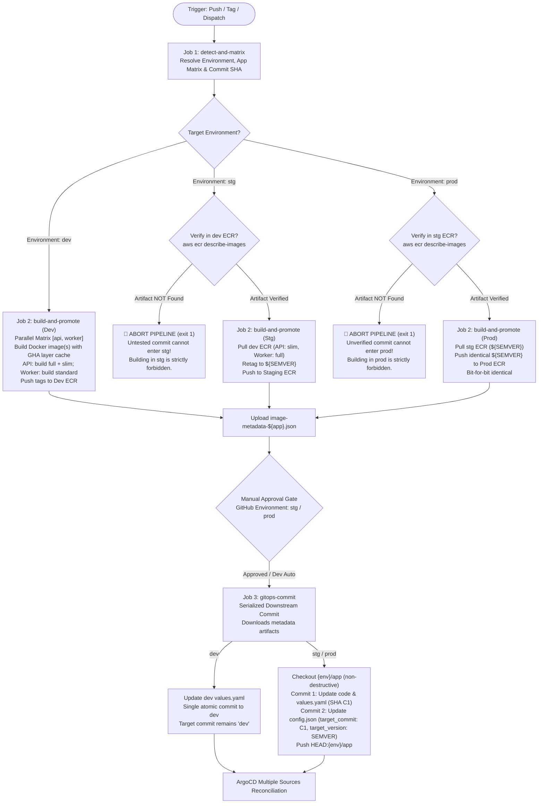

# Task 507: Multi-Environment API & Worker Container CI/CD Pipeline (`api-worker-cicd.yml`)

## 1. Goal

Implement a unified, enterprise-grade, multi-environment, tag-driven CI/CD deployment pipeline for backend microservices (`apps/api` and `apps/worker`) in `.github/workflows/api-worker-cicd.yml`. This pipeline consolidates and supersedes the legacy service workflows (`api-cicd.yml`, `worker-cicd.yml`, and `reusable-docker-helm-cicd.yml`) into a single, cohesive workflow that enforces:

1. **Build Once in Dev, Promote Identical Immutable Images to Stg/Prod**: Docker images are built strictly in `dev`. Staging and production releases never re-build containers; instead, they pull, verify, retag, and promote the exact tested artifact from the lower environment ECR repository (`dev -> stg`, `stg -> prod`).
2. **Dual Image Variant Strategy for API in Dev**: In `dev`, the workflow builds both `full` (with Swagger UI) and `slim` (production-optimized) container variants, pushing tags `${SHORT_SHA}` and `${SHORT_SHA}-slim`. Promotion to staging for API explicitly promotes the tested `slim` variant as the canonical release image.
3. **Parallel Multi-App Matrix Execution**: Simultaneous changes or dispatches trigger parallel container packaging and promotion across `api` and `worker` microservices.
4. **Fail-Fast ECR Verification**: Higher-environment releases assert that the prerequisite container image exists in the lower environment ECR repository prior to promotion, aborting immediately with an actionable error if untested code is referenced.
5. **GitHub Environment Approval Gates**: Staging and production releases enforce reviewer approval gates before modifying GitOps manifests.
6. **Non-Destructive Selective Checkouts on `{env}/app`**: Releases to `{env}/app` selectively check out only the target microservice's code and manifests (`apps/${app}/**` and `infra/k8s/argocd/${env}/${app}/**`), preventing destructive deletions of the sibling microservice on the shared branch.
7. **Clean GitOps Commit Optimization**:
   * **In `dev`**: Updates `values.yaml` in a single atomic commit, preserving live trunk branch discovery (`"target_commit": "dev"` in `config.json`).
   * **In `stg` / `prod`**: Executes a 2-commit immutable release dance pushed together in a single `git push`: Commit 1 updates code and `values.yaml` (generating commit SHA `C1`); Commit 2 updates `config.json` with `"target_commit": "C1"` and human-auditable `"target_version": "${SEMVER}"`.
8. **Global Serialized Git Concurrency**: Employs `git-commit-dev` for `dev` (shared across `helm-cicd.yml` and `api-worker-cicd.yml`) and `git-commit-${env}-app` for higher environments to eliminate git ref locking and push rejections.

---

## 2. Prerequisites & Architecture References

* **ECR Hierarchical Repositories (Task 505)**: Repositories configured with slash namespaces (`${project_name}/${environment}/api` and `${project_name}/${environment}/worker`) in `infra/terraform/aws/modules/ecr/main.tf`.
* **ArgoCD Multi-Source ApplicationSet (Task 505)**: `infra/terraform/k8s/manifests/argocd-applicationset.yaml` configured with Matrix generator resolving application values from Git branch `revision: '${targetRevision_app}'` (pointing to `dev` or `{env}/app`) and pinned commit `targetRevision: '{{target_commit}}'`.
* **GitOps Directory Structure**:
  * `infra/k8s/argocd/${environment}/api/values.yaml` & `config.json`
  * `infra/k8s/argocd/${environment}/worker/values.yaml` & `config.json`
* **Architecture Specifications**:
  * [Multi-Environment Infrastructure CI/CD Specification](file:///Users/parth/RAG/Document%20Intelligence%20Platform/docs/context/infrastructure-cicd-spec.md)
  * [Helm GitOps Multi-Source OCI & ApplicationSet Architecture Specification](file:///Users/parth/RAG/Document%20Intelligence%20Platform/docs/context/helm-gitops-multi-source-spec.md)

---

## 3. Workflow Trigger Configuration

The workflow `.github/workflows/api-worker-cicd.yml` supports three trigger modalities:

```yaml
name: API & Worker CI/CD Pipeline

on:
  push:
    branches:
      - dev
    paths:
      - 'apps/api/**'
      - 'apps/worker/**'
  tags:
    - 'stg-api-v*'
    - 'stg-worker-v*'
    - 'prod-api-v*'
    - 'prod-worker-v*'
  workflow_dispatch:
    inputs:
      app:
        description: 'Select application to build and deploy (dev only)'
        required: true
        type: choice
        options:
          - 'all'
          - 'api'
          - 'worker'
        default: 'all'
      image_to_deploy:
        description: 'Select API image variant to deploy to dev (applies to api only)'
        required: false
        type: choice
        options:
          - 'full'
          - 'slim'
        default: 'full'
```

> **Note on Tag Triggers**: GitHub Actions evaluates tag push filters independently from path filters. Tags must reside at the top level of `on` or under `on.push.tags` to trigger reliably regardless of file paths.

---

## 4. Pipeline Architecture & Execution Flow

The workflow is structured into three decoupled phases to maintain clean separation of concerns, execute parallel matrix container builds and promotions, and guarantee race-condition-free GitOps commits:



---

## 5. Detailed Job Specifications

### 5.1 Job 1: `detect-and-matrix` (Release Metadata & Matrix Resolution)

* **Runs On**: `ubuntu-latest`
* **Outputs**:
  * `env`: Target deployment environment (`dev`, `stg`, `prod`).
  * `matrix`: JSON array of applications to build/promote (`["api"]`, `["worker"]`, or `["api", "worker"]`).
  * `target_version`: Target image tag (`${SHORT_SHA}` or `${SHORT_SHA}-slim` for `dev`, clean `${SEMVER}` for `stg`/`prod`).
  * `source_env`: Lower environment identifier (`dev` for `stg`, `stg` for `prod`, empty for `dev`).
  * `source_tag`: Tag to pull from lower environment ECR (API: `${SHORT_SHA}-slim`, Worker: `${SHORT_SHA}` when promoting to `stg`; `${SEMVER}` when promoting to `prod`).
  * `short_sha`: Git commit short SHA (`git rev-parse --short HEAD`).
  * `commit_sha`: Full 40-character commit SHA (`${{ github.sha }}`).
  * `image_to_deploy`: Selected API deployment variant (`full` or `slim`).

#### Operational Logic:
1. **Tag Trigger Detection (`stg` and `prod`)**:
   * Evaluates `github.ref_type == 'tag'` or `github.ref == refs/tags/*`.
   * Matches format `{env}-{app}-v{semver}` (e.g. `stg-api-v1.2.0`, `prod-worker-v1.0.0`).
   * Extracts `TARGET_ENV` (`stg` or `prod`).
   * Extracts `APP` (`api` or `worker`).
   * Extracts `SEMVER` (stripping `{env}-{app}-v` prefix).
   * **Cardinality Guarantee**: Pushing a tag sets `MATRIX="[\"$APP\"]"` (strictly 1 element).
   * Computes promotion tags:
     * If `TARGET_ENV == "stg"`: `SOURCE_ENV="dev"`, `TARGET_VERSION="$SEMVER"`.
       * For `api`: `SOURCE_TAG="${SHORT_SHA}-slim"`.
       * For `worker`: `SOURCE_TAG="${SHORT_SHA}"`.
     * If `TARGET_ENV == "prod"`: `SOURCE_ENV="stg"`, `TARGET_VERSION="$SEMVER"`, `SOURCE_TAG="$SEMVER"`.
2. **Manual `workflow_dispatch` Detection (`dev` only)**:
   * Sets `TARGET_ENV="dev"`, `SOURCE_ENV=""`, `SOURCE_TAG=""`.
   * Sets `IMAGE_TO_DEPLOY="${{ inputs.image_to_deploy }}"` (default `full`).
   * Resolves matrix from `inputs.app`:
     * `'api'` $\rightarrow$ `MATRIX="[\"api\"]"`
     * `'worker'` $\rightarrow$ `MATRIX="[\"worker\"]"`
     * `'all'` $\rightarrow$ `MATRIX="[\"api\", \"worker\"]"`
   * Sets `TARGET_VERSION="${SHORT_SHA}"` (or `${SHORT_SHA}-slim` if `image_to_deploy == 'slim'` and `app == 'api'`).
3. **Push to `dev` Detection**:
   * Sets `TARGET_ENV="dev"`, `IMAGE_TO_DEPLOY="full"`, `TARGET_VERSION="${SHORT_SHA}"`.
   * Evaluates path diff between `HEAD~1` and `HEAD`:
     * `API_CHANGED=$(git diff --name-only HEAD~1 HEAD 2>/dev/null | grep -E '^apps/api/' || true)`
     * `WORKER_CHANGED=$(git diff --name-only HEAD~1 HEAD 2>/dev/null | grep -E '^apps/worker/' || true)`
   * Formulates matrix dynamically:
     * Only API changed $\rightarrow$ `MATRIX="[\"api\"]"`
     * Only Worker changed $\rightarrow$ `MATRIX="[\"worker\"]"`
     * Both changed (or merge commit) $\rightarrow$ `MATRIX="[\"api\", \"worker\"]"`

---

### 5.2 Job 2: `build-and-promote` (Parallel Matrix Build / Promotion)

* **Runs On**: `ubuntu-latest`
* **Strategy**: `matrix.app: ${{ fromJson(needs.detect-and-matrix.outputs.matrix) }}`
* **Permissions**: `id-token: write`, `contents: read`
* **Steps & Execution Logic**:
  1. **Checkout Code**: Uses `actions/checkout@v4` with `fetch-depth: 0`.
  2. **Terraform Query for ECR URLs**:
     * Runs `infra/terraform/query` against `infra/terraform/aws/environments/${ENV}/backend.config.hcl` to retrieve `${TARGET_ECR_REPO}`.
     * In `stg` and `prod`, also queries `infra/terraform/aws/environments/${SOURCE_ENV}/backend.config.hcl` to retrieve `${SOURCE_ECR_REPO}`.
     * Fails fast if remote state is missing or repository URLs are not exported.
  3. **AWS Authentication**: Assumes GitHub Actions CI role via `aws-actions/configure-aws-credentials` and logs in to ECR via `aws-actions/amazon-ecr-login`.
  4. **Branch A: Dev Environment (Build & Push)**:
     * Sets up Docker Buildx with GitHub Actions caching (`cache-from: type=gha`, `cache-to: type=gha,mode=max`).
     * **For `api`**:
       * Builds full image: `target: runner`, `build-args: ENVIRONMENT=dev`, tagged `${TARGET_ECR_REPO}:${SHORT_SHA}`.
       * Builds slim image: `target: runner`, `build-args: ENVIRONMENT=prod`, tagged `${TARGET_ECR_REPO}:${SHORT_SHA}-slim`.
       * Pushes both tags to Dev ECR.
       * Sets deployed tag: `${SHORT_SHA}-slim` if `image_to_deploy == 'slim'`, otherwise `${SHORT_SHA}`.
     * **For `worker`**:
       * Builds worker image: `context: apps/worker`, tagged `${TARGET_ECR_REPO}:${SHORT_SHA}`.
       * Pushes to Dev ECR.
       * Sets deployed tag: `${SHORT_SHA}`.
  5. **Branch B: Staging / Production Promotion (Verify, Pull & Push)**:
     * **Fail-Fast Image Verification**:
       ```bash
       echo "Verifying image ${SOURCE_TAG} exists in source ECR ${SOURCE_ECR_REPO}..."
       REPO_NAME=$(echo "$SOURCE_ECR_REPO" | cut -d'/' -f2-)
       TAG_EXISTS=$(aws ecr describe-images \
         --repository-name "$REPO_NAME" \
         --image-ids imageTag="${SOURCE_TAG}" \
         --query 'imageDetails[0].imageTags[0]' \
         --output text 2>/dev/null || echo "")

       if [ "$TAG_EXISTS" != "${SOURCE_TAG}" ]; then
         echo "::error::Prerequisite image '${SOURCE_ECR_REPO}:${SOURCE_TAG}' not found in ${SOURCE_ENV} ECR!"
         echo "::error::Untested/unverified code cannot enter ${ENV}! Deploy to ${SOURCE_ENV} first."
         exit 1
       fi
       ```
     * **Pull and Retag**:
       ```bash
       docker pull "${SOURCE_ECR_REPO}:${SOURCE_TAG}"
       docker tag "${SOURCE_ECR_REPO}:${SOURCE_TAG}" "${TARGET_ECR_REPO}:${TARGET_TAG}"
       docker push "${TARGET_ECR_REPO}:${TARGET_TAG}"
       ```
     * Sets deployed tag: `${TARGET_TAG}` (`${SEMVER}`).
  6. **Emit Metadata Artifact**:
     * Writes JSON metadata file `/tmp/metadata/image-${APP}.json`:
       ```json
       {
         "app": "${APP}",
         "image_tag": "${DEPLOYED_TAG}",
         "ecr_repo": "${TARGET_ECR_REPO}"
       }
       ```
     * Uploads artifact `image-metadata-${APP}` via `actions/upload-artifact@v4`.

---

### 5.3 Job 3: `gitops-commit` (Single Serialized Downstream GitOps Commit Job)

* **Runs On**: `ubuntu-latest`
* **Needs**: `[detect-and-matrix, build-and-promote]`
* **Environment**: `${{ needs.detect-and-matrix.outputs.env }}` (pauses execution on `stg` and `prod` for reviewer approvals).
* **Concurrency Locking**:
  ```yaml
  concurrency:
    group: git-commit-${{ needs.detect-and-matrix.outputs.env == 'dev' && 'dev' || format('{0}-app', needs.detect-and-matrix.outputs.env) }}
    cancel-in-progress: false
  ```
* **Permissions**: `contents: write`
* **Steps & Execution Logic**:
  1. **Checkout Code**: Uses `actions/checkout@v4` with `fetch-depth: 0`.
  2. **Download Metadata Artifacts**: Uses `actions/download-artifact@v4` with pattern `'image-metadata-*'` to `/tmp/image-metadata` with `merge-multiple: true`.
  3. **Git Identity Setup**:
     ```bash
     git config --global user.name "github-actions[bot]"
     git config --global user.email "github-actions[bot]@users.noreply.github.com"
     ```
  4. **Branch A: Dev Environment Commit (Trunk Optimization)**:
     * Checks out `dev` branch and pulls with rebase: `git checkout dev && git pull --rebase origin dev`.
     * Loops through downloaded metadata files (`/tmp/image-metadata/image-*.json`):
       * Reads `app`, `image_tag`, and `ecr_repo`.
       * Updates `container.image.tag` and `container.image.repository` in `infra/k8s/argocd/dev/${app}/values.yaml`.
       * Leaves `config.json` intact with `"target_commit": "dev"`.
       * Stages `infra/k8s/argocd/dev/${app}/values.yaml`.
     * Commits all changes in a single atomic commit:
       ```bash
       git commit -m "release(app): update container image(s) [${APPS[*]}] to ${SHORT_SHA} [skip ci]" \
                  -m "Environment: dev" \
                  -m "Workflow Run: ${{ github.server_url }}/${{ github.repository }}/actions/runs/${{ github.run_id }}" \
           || echo "No changes to commit"
       ```
     * Pushes to `dev`:
       ```bash
       git pull --rebase origin dev
       git push origin HEAD:dev
       ```
  5. **Branch B: Staging / Production Commit (Immutable Release Pattern)**:
     * Target branch is `${ENV}/app` (e.g. `stg/app` or `prod/app`).
     * Fetches or initializes the tracking branch:
       ```bash
       git fetch origin "${ENV}/app:${ENV}/app" 2>/dev/null || git branch "${ENV}/app"
       git checkout "${ENV}/app"
       git pull --rebase origin "${ENV}/app"
       ```
     * **Non-Destructive Selective Code Checkout**:
       ```bash
       git checkout "tags/${TAG_NAME}" -- "apps/${APP}"
       ```
       *(Preserves sibling microservice code and configuration intact!)*
     * **Update Manifest Values**:
       * Updates `container.image.tag` to `${SEMVER}` and `container.image.repository` in `infra/k8s/argocd/${ENV}/${APP}/values.yaml`.
     * **Commit 1 (Code & Values)**:
       ```bash
       git add "apps/${APP}" "infra/k8s/argocd/${ENV}/${APP}/values.yaml"
       git commit -m "release(${APP}): deploy ${APP} ${SEMVER} [skip ci]" \
                  -m "Release Tag: ${TAG_NAME}" \
                  -m "Source Commit: ${{ needs.detect-and-matrix.outputs.commit_sha }}" \
           || echo "No changes to commit"
       ```
     * **Capture Commit 1 Hash**:
       ```bash
       C1_SHA=$(git rev-parse HEAD)
       ```
     * **Update Config with Immutable Pinned Hash and Auditable Version**:
       * Updates `infra/k8s/argocd/${ENV}/${APP}/config.json`:
         ```json
         {
           "app": "${APP}",
           "target_commit": "${C1_SHA}",
           "target_version": "${SEMVER}"
         }
         ```
     * **Commit 2 (Pinned Pointer)**:
       ```bash
       git add "infra/k8s/argocd/${ENV}/${APP}/config.json"
       git commit -m "chore(${APP}): pin target_commit to ${C1_SHA} for ${SEMVER} [skip ci]" \
           || echo "No changes to commit"
       ```
     * **Atomic Push**:
       ```bash
       git pull --rebase origin "${ENV}/app"
       git push origin HEAD:"${ENV}/app"
       ```

---

## 6. Local Testing & Verification Strategy (`act`)

Provide local simulation fixtures under `.github/workflows/api-worker-cicd/`:

1. **Mock Event Fixtures**:
   * `events/push-dev.json`: Simulates push to `dev` touching `apps/api/src/index.ts`.
   * `events/push-dev-both.json`: Simulates push to `dev` touching both `apps/api/` and `apps/worker/`.
   * `events/dev-all.json`: Simulates manual `workflow_dispatch` selecting `all`.
   * `events/tag-stg-api.json`: Simulates pushing tag `stg-api-v1.0.0`.
   * `events/tag-prod-worker.json`: Simulates pushing tag `prod-worker-v1.0.0`.
2. **Local Taskfile (`.github/workflows/api-worker-cicd/Taskfile.yaml`)**:
   * `task test-push-dev`: Executes `act` simulation using `events/push-dev.json`.
   * `task test-tag-stg`: Executes `act` simulation using `events/tag-stg-api.json`.
   * `task test-tag-prod`: Executes `act` simulation using `events/tag-prod-worker.json`.

---

## 7. Acceptance Criteria & Definition of Done

- [ ] **Workflow File Created**: `.github/workflows/api-worker-cicd.yml` conforms to GitHub Actions syntax with all action dependencies pinned to full-length commit SHAs.
- [ ] **Build Once Enforced**: Docker containers are compiled strictly in `dev`. Staging and production jobs run ECR pull/retag/push without compiling from Dockerfile.
- [ ] **Dual API Variants in Dev**: Dev build produces both `${SHORT_SHA}` (full) and `${SHORT_SHA}-slim` (slim) for `api`, while `worker` produces standard `${SHORT_SHA}`.
- [ ] **Slim API Promotion**: Staging promotion for `api` explicitly pulls `${SHORT_SHA}-slim` from Dev ECR and tags as `${SEMVER}` in Staging ECR.
- [ ] **Promotion Verification & Fail Fast**: Staging checks `dev` ECR and production checks `stg` ECR; fails with exit code 1 if lower environment image is absent.
- [ ] **Parallel Matrix Execution**: Matrix builds/promotes run concurrently across `api` and `worker`.
- [ ] **Approval Gates Active**: Staging and production releases pause at the GitHub Environment gate before committing to `{env}/app`.
- [ ] **Non-Destructive Selective Checkouts**: Updates to `{env}/app` preserve sibling microservice directories and files.
- [ ] **Two-Commit Immutable Pinned Pattern**: Staging and production release commits pin `"target_commit": "${C1_SHA}"` and record `"target_version": "${SEMVER}"` in `config.json`.
- [ ] **Trunk Optimization**: Dev releases update `values.yaml` in a single commit, preserving `"target_commit": "dev"` in `config.json`.
- [ ] **Serialized Concurrency**: Uses `git-commit-dev` for `dev` and `git-commit-${env}-app` for higher environments.
- [ ] **Legacy Workflows Deprecated/Replaced**: Obsolete `.github/workflows/api-cicd.yml`, `.github/workflows/worker-cicd.yml`, and `.github/workflows/reusable-docker-helm-cicd.yml` are safely retired or deprecated.
- [ ] **Documentation Updated**: Update `docs/progress/implementation-status.md` and `docs/context/current-state.md` to reflect Task 507.
